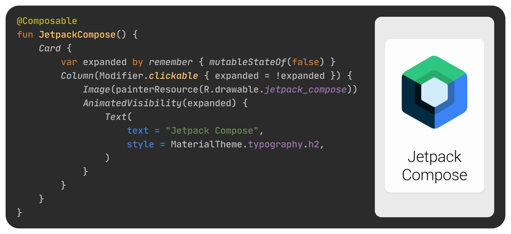

# Introducción a Jetpack Compose

> Aprende los fundamentos de Jetpack Compose, el toolkit moderno de Android para crear interfaces nativas. Comprende la diferencia entre programación declarativa e imperativa.

*Básicos · 15 de enero de 2024 · 8 min de lectura*  
*Fuente (en inglés): <https://www.jetpackcompose.net/jetpack-compose-introduction>*

## ¿Qué es Jetpack Compose?

Jetpack Compose es un toolkit moderno para crear interfaces de usuario nativas en Android. Simplifica y acelera el desarrollo de la interfaz en Android con menos código, herramientas potentes y APIs de Kotlin intuitivas.

Jetpack Compose utiliza **programación declarativa**, lo que significa que describes tu interfaz de usuario invocando un conjunto de composables. Durante los últimos diez años hemos utilizado el enfoque tradicional de **diseño de UI imperativo**.

**Código de ejemplo y resultado**



## Programación imperativa vs. declarativa

**UI imperativa**: este es el paradigma más habitual. Consiste en tener un prototipo o modelo independiente de la interfaz de la aplicación. Este diseño se centra en el *cómo* más que en el *qué*. Un buen ejemplo son los layouts XML de Android: diseñamos los widgets y componentes, que luego se renderizan para que el usuario los vea e interactúe con ellos.

**Código de ejemplo de UI imperativa:**

XML:

```xml
<TextView
    android:id="@+id/tv_name"
    android:layout_width="match_parent"
    android:layout_height="wrap_content"
/>
```

Java:

```java
public class MainActivity extends AppCompatActivity {

    TextView tvName;
    @Override
    protected void onCreate(Bundle savedInstanceState) {
        super.onCreate(savedInstanceState);
        setContentView(R.layout.activity_checkbox);
        tvName = findViewById(R.id.tv_name);
        tvName.setText("Hello World");
    }
}
```

**UI declarativa**: este patrón es una tendencia emergente que permite a los desarrolladores diseñar la interfaz de usuario en función de los datos recibidos. Se centra en el *qué* más que en el *cómo*. Este paradigma de diseño utiliza un único lenguaje de programación para crear una aplicación completa.

```kotlin
class MainActivity : ComponentActivity() {
    override fun onCreate(savedInstanceState: Bundle?) {
        super.onCreate(savedInstanceState)
        setContent {
            Text(text = "Hello World")
        }
    }
}
```

*En Jetpack Compose no hace falta ningún código XML. Podemos crear vistas mediante composables.*

## Ventajas de Jetpack Compose

- Es muy rápido y ofrece un rendimiento fluido.
- Es sencillo de aprender.
- Puede interoperar con el enfoque imperativo.
- Ofrece una mejor forma de aplicar los principios de bajo acoplamiento.
- Está hecho al 100 % en Kotlin, lo que lo convierte en un enfoque moderno para el desarrollo en Android.

## Funciones composable

Una función composable es como cualquier otra función en programación, pero hay que anotarla con la anotación @Composable.

**Sintaxis:**

```kotlin
@Composable
fun MethodName(parameter: String) {
    // your content
}
```

**Ejemplo:**

```kotlin
@Composable
fun Greeting(name: String) {
    Text(text = "Hello $name!")
}
```

En este ejemplo hemos creado una nueva función composable llamada **Greeting()**. Usamos `Text()` como contenido, que es una función composable incluida de serie. Podemos añadir funciones composable dentro de otras funciones composable.

Después de crear una función composable, podemos usarla como contenido.

**Aplicación Hello World de ejemplo con Jetpack Compose:**

```kotlin
class MainActivity : ComponentActivity() {
    override fun onCreate(savedInstanceState: Bundle?) {
        super.onCreate(savedInstanceState)
        setContent {
            Greeting("World")
        }
    }
}

@Composable
fun Greeting(name: String) {
    Text(text = "Hello $name!")
}
```

## ¿Debo usar Jetpack Compose en mi Android Studio actual?

Si utilizas la versión estable, la respuesta es no.

Necesitas la versión Beta de Android Studio. También tienes que añadir algunas dependencias para Jetpack Compose.

```groovy
//compose_version = '1.0.2'
implementation 'androidx.activity:activity-compose:1.3.0-alpha06'
implementation "androidx.compose.ui:ui:$compose_version"
implementation "androidx.compose.material:material:$compose_version"
implementation "androidx.compose.ui:ui-tooling:$compose_version"
```

## Conclusión

En los próximos tutoriales exploraremos más funciones composable.

Consulta la página del tutorial oficial para más detalles sobre Jetpack Compose: <https://developer.android.com/jetpack/compose/tutorial>

**Proyectos de ejemplo disponibles en GitHub:** <https://github.com/android/compose-samples>
