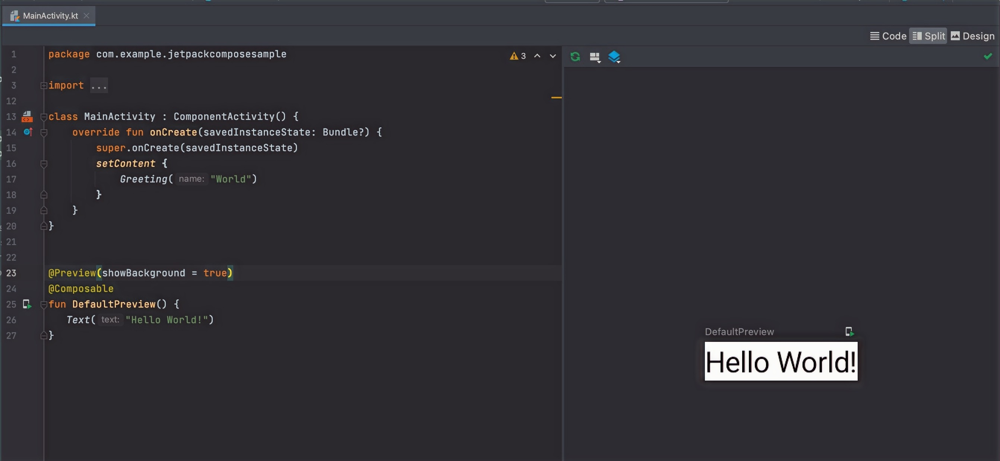
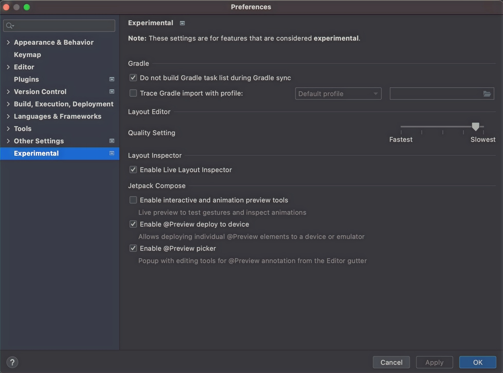
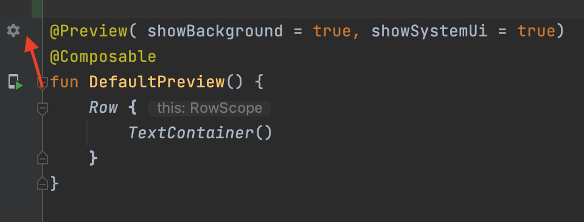
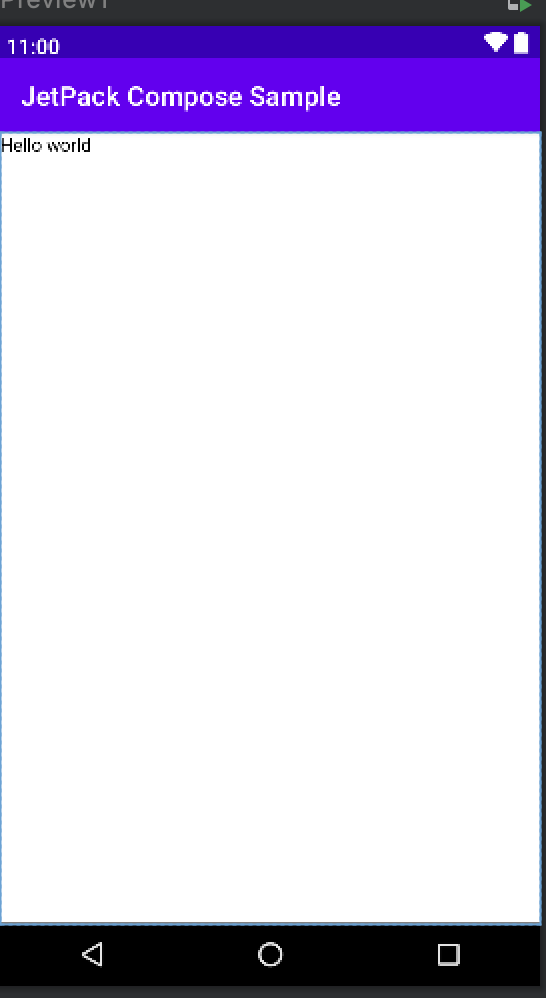

# Jetpack Compose Preview

> Domina la función Preview de Jetpack Compose para ver los cambios de tu interfaz al instante, sin ejecutar la aplicación en un dispositivo o emulador.

*Básicos · 20 de enero de 2024 · 6 min de lectura*  
*Fuente (en inglés): <https://www.jetpackcompose.net/jetpack-compose-preview>*

## Introducción

En Jetpack Compose podemos ver una vista previa de nuestro código en Android Studio. Nos permite **ver el resultado sin ejecutar la aplicación.**

Haz clic en **Split** para ver a la vez el código y la vista previa.



## Cómo añadir una vista previa

Debes añadir la anotación **@Preview()** antes de la función composable. Tras añadirla, podrás ver la vista previa de tu interfaz.

```kotlin
@Preview()
@Composable
fun DefaultPreview() {
    Text("Hello World!")
}
```

## Opciones de personalización de @Preview

Si analizas la clase @Preview, verás que tiene muchas funciones útiles. Haz CTRL + clic sobre la anotación @Preview para ver las siguientes opciones:

```kotlin
annotation class Preview(
    val name: String = "",
    val group: String = "",
    @IntRange(from = 1) val apiLevel: Int = -1,
    val widthDp: Int = -1,
    val heightDp: Int = -1,
    val locale: String = "",
    @FloatRange(from = 0.01) val fontScale: Float = 1f,
    val showSystemUi: Boolean = false,
    val showBackground: Boolean = false,
    val backgroundColor: Long = 0,
    @UiMode val uiMode: Int = 0,
    @Device val device: String = Devices.DEFAULT
)
```

## Cómo personalizarla

Hay dos formas de personalizar la vista previa:

1. Definir la personalización escribiéndola manualmente.
2. Usar la herramienta de edición de la vista previa.

## Pasos para activar la herramienta de edición de la vista previa

La herramienta de edición de la vista previa no está disponible por defecto. Para activarla, sigue estos pasos:

1. Haz clic en **Android Studio** en el menú superior.
2. Ve a **Settings** (en Mac: haz clic en **Preferences**).
3. Haz clic en **Experimental**.
4. Marca la casilla **Enable @Preview picker**.
5. Haz clic en **Apply** y después en **OK**.



Tras activarlo, verás el icono de ajustes en @Preview.



## 1. Nombre (name)

```kotlin
@Preview(name = "Preview1")
```

Si indicas el argumento `name`, se mostrará el nombre dado ("Preview1") en el área de vista previa. Como puedes añadir varias vistas previas en la misma clase, darle un nombre a cada una te ayuda a identificarlas fácilmente.

## 2. Fondo (background)

La función composable no define ningún fondo por sí misma, pero puedes añadir uno a la vista previa estableciendo **showBackground = true** en la anotación Preview. También existe el argumento **backgroundColor** para cambiar el color.

```kotlin
@Preview(name = "Preview1", showBackground = true, backgroundColor = 0xFF03A9F4)
```

## 3. Alto y ancho (height y width)

Por defecto, una función composable ajusta su ancho y su alto a **wrap_content**. Si quieres cambiarlo, pasa los valores deseados de **widthDp** y **heightDp**.

```kotlin
@Preview(name = "Preview1", showBackground = true, widthDp = 200, backgroundColor = 0xFF03A9F4, heightDp = 50)
@Composable
fun DefaultPreview() {
    Text(text = "Hello world")
}
```

## 4. SystemUI y dispositivo

Puedes previsualizar una función composable en una pantalla simulada (con barra de estado, barra de herramientas y menú de navegación). Basta con establecer **showSystemUi = true**. También puedes cambiar el marco del dispositivo utilizado, por ejemplo: **device = Devices.PIXEL**.

```kotlin
@Preview(name = "Preview1", device = Devices.PIXEL, showSystemUi = true)
@Composable
fun DefaultPreview() {
    Text(text = "Hello world")
}
```

**Vista previa:**



## 5. Varias vistas previas

Puedes añadir varias vistas previas añadiendo anotaciones @Preview a tus composables.

```kotlin
@Preview(name = "Preview1", showBackground = true, backgroundColor = 0xFF2196F3)
@Composable
fun Preview1() {
    Text(text = "Hello world 1")
}

@Preview(name = "Preview2", showBackground = true, backgroundColor = 0xFF2196F3)
@Composable
fun Preview2() {
    Text(text = "Hello world 2")
}
```

## Conclusión

Espero que ahora tengas una comprensión básica de la anotación @Preview. Consulta los siguientes tutoriales para más detalles.

**Tutorial oficial:** <https://developer.android.com/jetpack/compose/tooling>
