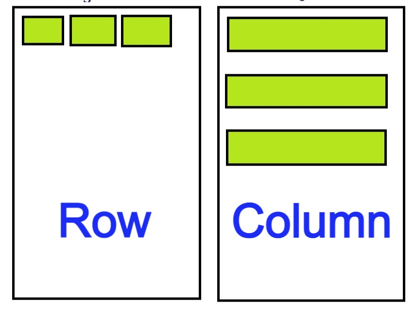
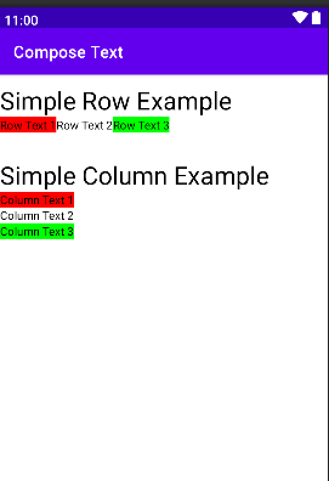
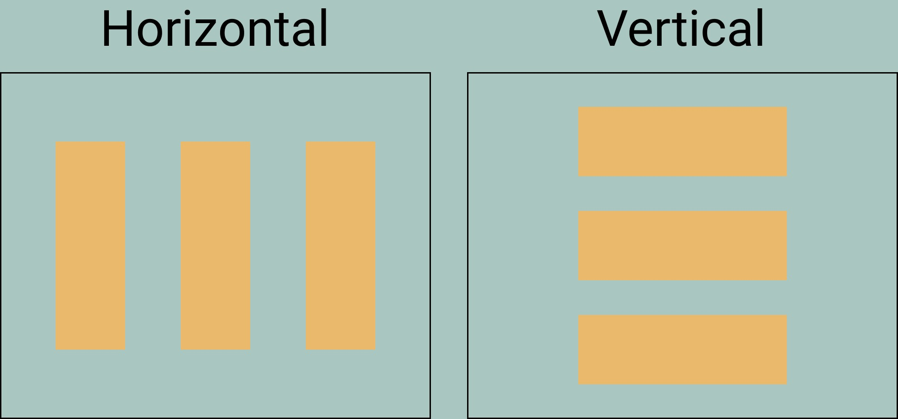
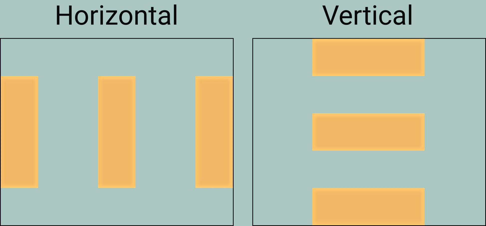
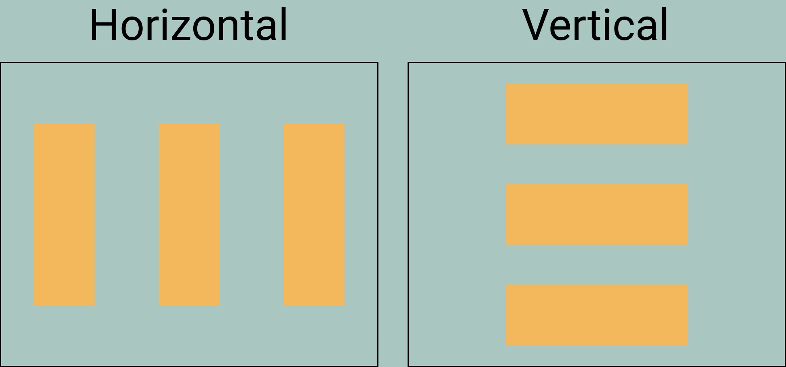

# Compose Layouts: Row, Column y Box

Aprende a organizar los elementos de la interfaz en horizontal, vertical y por capas tridimensionales usando los composables fundamentales de Jetpack Compose.

*Básicos · Actualizado · 15 min de lectura*  
Fuente base (en inglés): <https://jetpackcompose.net>

---

## ¿Qué son los layouts en Android?

Un layout proporciona un contenedor invisible que alberga componentes visuales (hijos) u otros layouts. Row, Column y Box son los tres pilares fundamentales en Jetpack Compose para estructurar pantallas.

*   **Row**: organiza las vistas horizontalmente (una al lado de la otra).
*   **Column**: organiza las vistas verticalmente (una debajo de la otra).
*   **Box**: organiza las vistas por capas (una encima de la otra, como platos apilados).



---

## Contenedores Básicos y Lineales

### 1. Row (Fila)
Un `Row` muestra cada hijo a continuación del anterior en el eje horizontal. Funciona de forma equivalente a un `LinearLayout` con orientación horizontal del sistema de vistas clásico.

```kotlin
@Composable
fun SimpleRow(){
    Row {
        Text(text = "Row Text 1", Modifier.background(Color.Red))
        Text(text = "Row Text 2", Modifier.background(Color.White))
        Text(text = "Row Text 3", Modifier.background(Color.Green))
    }
}
```

### 2. Column (Columna)
Un `Column` muestra cada hijo debajo de los anteriores en el eje vertical. Funciona de forma equivalente a un `LinearLayout` con orientación vertical.

```kotlin
@Composable
fun SimpleColumn(){
    Column {
        Text(text = "Column Text 1", Modifier.background(Color.Red))
        Text(text = "Column Text 2", Modifier.background(Color.White))
        Text(text = "Column Text 3", Modifier.background(Color.Green))
    }
}
```



---

## El Contenedor Box (Capas y Superposición)

A diferencia de `Row` y `Column`, el contenedor `Box` no ordena los elementos de forma secuencial. Si se colocan tres elementos dentro de un `Box` sin modificar sus parámetros, se dibujarán uno encima del otro en la esquina superior izquierda.

Es el contenedor ideal para:
*   Colocar texto o iconos sobre una imagen de fondo.
*   Crear indicadores de notificación (un círculo de color sobre el icono de una campana).
*   Dibujar elementos flotantes o barras de progreso superpuestas.

```kotlin
@Composable
fun SimpleBox() {
    Box(modifier = Modifier.size(150.dp).background(Color.LightGray)) {
        // La caja roja se dibuja primero (al fondo)
        Box(modifier = Modifier.size(100.dp).background(Color.Red))
        // La caja azul se dibuja encima de la roja
        Box(modifier = Modifier.size(50.dp).background(Color.Blue))
    }
}
```

---

## Alineación (Alignment) vs Disposición (Arrangement)

Para comprender el posicionamiento, es fundamental dominar estos dos conceptos esenciales:
*   **Eje Principal (Main Axis):** El eje en el que el contenedor añade sus elementos (Horizontal en `Row`, Vertical en `Column`). Se controla con **Arrangement**.
*   **Eje Cruzado (Cross Axis):** El eje perpendicular al principal (Vertical en `Row`, Horizontal en `Column`). Se controla con **Alignment**.
*   **En Box (Sin ejes lineales):** No existe un eje de propagación lineal. Todo el posicionamiento se maneja directamente con **Alignment** combinando sus dos dimensiones.

---

## Las 9 Opciones de Alineación (Alignment)

La alineación define cómo se posicionan los elementos respecto al eje cruzado o dentro de un espacio bidimensional:

### A. Alineación Vertical (Exclusiva para usar dentro de un `Row`)
*   `Alignment.Top`: Eleva los elementos al borde superior.
*   `Alignment.CenterVertically`: Centra los elementos verticalmente.
*   `Alignment.Bottom`: Baja los elementos al borde inferior.

### B. Alineación Horizontal (Exclusiva para usar dentro de un `Column`)
*   `Alignment.Start`: Empuja los elementos al inicio (izquierda).
*   `Alignment.CenterHorizontally`: Centra los elementos horizontalmente.
*   `Alignment.End`: Empuja los elementos al final (derecha).

### C. Alineación Bidimensional (Para usar en `Box` o de forma individual)
Al combinar coordenadas horizontales y verticales, se obtienen 9 puntos exactos para posicionar elementos en un plano:
*   `Alignment.TopStart` (Superior Izquierda)
*   `Alignment.TopCenter` (Superior Centro)
*   `Alignment.TopEnd` (Superior Derecha)
*   `Alignment.CenterStart` (Centro Izquierda)
*   `Alignment.Center` (Centro Absoluto)
*   `Alignment.CenterEnd` (Centro Derecha)
*   `Alignment.BottomStart` (Inferior Izquierda)
*   `Alignment.BottomCenter` (Inferior Centro)
*   `Alignment.BottomEnd` (Inferior Derecha)

> **Nota técnica:** También es posible aplicar estas alineaciones de forma individual en un único hijo utilizando el modificador `Modifier.align()`.

---

## Disposición (Arrangement)

El `Arrangement` define cómo se distribuye el espacio sobrante a lo largo del eje principal en filas y columnas:

*   **SpaceEvenly:** Reparte los elementos uniformemente, dejando el mismo espacio entre ellos y en los extremos exteriores.
    
*   **SpaceBetween:** Empuja el primer elemento al inicio absoluto y el último al final absoluto, repartiendo el espacio restante únicamente en las separaciones intermedias.
    
*   **SpaceAround:** Cada elemento tiene el mismo espacio a sus lados, lo que provoca que el espacio en los extremos exteriores sea la mitad de ancho que el espacio intermedio.
    

---

## Ejemplos Avanzados de Código

### Ejemplo 1: Distribución en Column
```kotlin
@Composable
fun ColumnArrangement(){
    Column(
        modifier = Modifier.fillMaxHeight().fillMaxWidth(),
        verticalArrangement = Arrangement.SpaceEvenly, // Eje Principal
        horizontalAlignment = Alignment.End // Eje Cruzado
    ) {
        Text(text = "Text 1", Modifier.background(Color.Red))
        Text(text = "Text 2", Modifier.background(Color.White))
        Text(text = "Text 3", Modifier.background(Color.Green))
    }
}
```

### Ejemplo 2: Posicionamiento preciso dentro de un Box
Es posible asignar una alineación general a todo el `Box`, o usar el modificador `.align()` en cada hijo para distribuirlos de forma independiente:

```kotlin
@Composable
fun AlignedBoxExample() {
    Box(modifier = Modifier.fillMaxSize().background(Color.DarkGray)) {
        // Un botón flotante en la esquina inferior derecha
        Button(
            onClick = { },
            modifier = Modifier.align(Alignment.BottomEnd).padding(16.dp)
        ) {
            Text("+")
        }

        // Un texto de carga exactamente en el centro de la pantalla
        Text(
            text = "Cargando...",
            color = Color.White,
            modifier = Modifier.align(Alignment.Center)
        )
    }
}
```

---

## Reto Práctico: Diseña una Tarjeta de Perfil Profesional

Para consolidar el uso combinado de `Row`, `Column` y `Box`, el siguiente ejercicio propone la réplica del componente de una tarjeta de usuario con una interfaz moderna.

### Requisitos del ejercicio:
1. **Contenedor Principal (`Box`):** Crear una caja con un tamaño fijo (por ejemplo, una tarjeta de 350.dp de ancho). 
2. **Fondo e Indicador (`Box` interno):** Colocar un pequeño círculo verde en la esquina superior derecha (`Alignment.TopEnd`) que funcione como indicador de estado "En línea".
3. **Estructura de Datos (`Column`):** Añadir una columna principal centrada para organizar el contenido verticalmente:
   * **Cabecera (`Row`):** Una fila que albergue un icono de usuario a la izquierda y, a su lado, una `Column` interna con el Nombre del usuario (en negrita) y su Puesto de trabajo.
   * **Sección de Botones (`Row`):** En la parte inferior, incluir dos botones ("Mensaje" y "Seguir"). Utilizar `Arrangement.SpaceAround` para distribuirlos de forma simétrica.

### Pistas para la resolución:
* El modificador `Modifier.clip(CircleShape)` permite recortar formas circulares para la foto o el indicador de estado.
* Los modificadores `.align()` individuales permiten omitir las reglas generales del contenedor padre cuando se requiere un posicionamiento específico.
