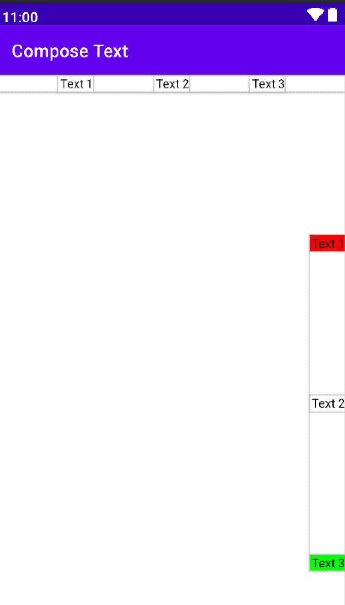

# Compose Layout: Row y Column

> Aprende a organizar los elementos de la interfaz en horizontal y en vertical con los composables Row y Column de Jetpack Compose.

*Básicos · 25 de enero de 2024 · 10 min de lectura*  
*Fuente (en inglés): <https://jetpackcompose.net>*

---

## ¿Qué son los layouts en Android?

Un layout proporciona un contenedor invisible que alberga vistas u otros layouts. Podemos colocar un grupo de vistas dentro de un layout. **Row** y **Column** son layouts que organizan nuestras vistas de forma lineal.

### ¿Qué es la disposición lineal?
Consiste en colocar los elementos uno detrás de otro. De este modo, los elementos se ordenan en secuencia, ya sea horizontal o verticalmente.

*   **Row**: organiza las vistas horizontalmente.
*   **Column**: organiza las vistas verticalmente.


---

## Uso Básico

### 1. Row (Fila)
Un `Row` muestra cada hijo a continuación del anterior. Funciona de forma equivalente a un `LinearLayout` con orientación horizontal del sistema de vistas clásico.

```kotlin
@Composable
fun SimpleRow(){
    Row {
        Text(text = "Row Text 1", Modifier.background(Color.Red))
        Text(text = "Row Text 2", Modifier.background(Color.White))
        Text(text = "Row Text 3", Modifier.background(Color.Green))
    }
}
```

### 2. Column (Columna)
Un `Column` muestra cada hijo debajo de los anteriores. Funciona de forma equivalente a un `LinearLayout` con orientación vertical.

```kotlin
@Composable
fun SimpleColumn(){
    Column {
        Text(text = "Column Text 1", Modifier.background(Color.Red))
        Text(text = "Column Text 2", Modifier.background(Color.White))
        Text(text = "Column Text 3", Modifier.background(Color.Green))
    }
}
```


---

## Alineación (Alignment) vs Disposición (Arrangement)

Para dominar los layouts en Compose, los alumnos deben entender la diferencia entre dos conceptos clave:
*   **Eje Principal (Main Axis):** El eje en el que el contenedor añade los elementos (Horizontal en `Row`, Vertical en `Column`). Se controla con **Arrangement**.
*   **Eje Cruzado (Cross Axis):** El eje perpendicular al principal (Vertical en `Row`, Horizontal en `Column`). Se controla con **Alignment**.

---

## Las 9 Opciones de Alineación (Alignment)

La alineación define cómo se posicionan los elementos respecto al **eje cruzado**. Dependiendo del contenedor, utilizaremos diferentes familias de alineaciones:

### A. Alineación Vertical (Para usar dentro de un `Row`)
Determina la posición de los elementos arriba, abajo o al centro de la fila.
*   `Alignment.Top`: Alinea los elementos en la parte superior.
*   `Alignment.CenterVertically`: Centra los elementos verticalmente.
*   `Alignment.Bottom`: Alinea los elementos en la parte inferior.

### B. Alineación Horizontal (Para usar dentro de un `Column`)
Determina la posición de los elementos a la izquierda, derecha o al centro de la columna.
*   `Alignment.Start`: Alinea al borde inicial (normalmente izquierda).
*   `Alignment.CenterHorizontally`: Centra los elementos horizontalmente.
*   `Alignment.End`: Alinea al borde final (normalmente derecha).

### C. Alineación Bidimensional (Para usar en contenedores como `Box`)
Cuando trabajamos en contenedores libres de dos ejes (como `Box`), combinamos ambas coordenadas para obtener **9 puntos exactos**:
*   `Alignment.TopStart` (Superior Izquierda)
*   `Alignment.TopCenter` (Superior Centro)
*   `Alignment.TopEnd` (Superior Derecha)
*   `Alignment.CenterStart` (Centro Izquierda)
*   `Alignment.Center` (Centro Absoluto)
*   `Alignment.CenterEnd` (Centro Derecha)
*   `Alignment.BottomStart` (Inferior Izquierda)
*   `Alignment.BottomCenter` (Inferior Centro)
*   `Alignment.BottomEnd` (Inferior Derecha)

> **💡 Nota para el alumno:** También puedes usar estas alineaciones de forma individual en un único hijo usando el modificador `Modifier.align()`.

---

## Disposición (Arrangement)

El `Arrangement` define cómo se distribuyen los elementos a lo largo del **eje principal** y cómo se reparte el espacio sobrante. Disponemos de tres disposiciones comunes:

*   **SpaceEvenly:** Reparte los elementos uniformemente, dejando el mismo espacio entre ellos, antes del primero y después del último.
    
*   **SpaceBetween:** Distribuye los elementos uniformemente empujando el primero al inicio y el último al final, sin dejar espacio libre en los extremos.
    
*   **SpaceAround:** Reparte el espacio de forma que cada elemento tiene la misma cantidad de espacio a ambos lados (el espacio en los extremos es la mitad del espacio entre elementos).
    

---

## Ejemplos Avanzados de Código

### Ejemplo 1: Disposición y alineación en Row
En este ejemplo, repartimos el espacio horizontalmente de forma equitativa (`SpaceEvenly`) y alineamos todos los textos en la parte superior (`Top`).

```kotlin
@Composable
fun RowArrangement(){
    Row(
        modifier = Modifier.fillMaxWidth(),
        verticalAlignment = Alignment.Top, // Eje Cruzado
        horizontalArrangement = Arrangement.SpaceEvenly // Eje Principal
    ) {
        Text(text = " Text 1")
        Text(text = " Text 2")
        Text(text = " Text 3")
    }
}
```

### Ejemplo 2: Disposición y alineación en Column
Aquí alineamos todos los elementos a la derecha (`End`) y los separamos de forma uniforme a lo largo de toda la altura disponible (`SpaceEvenly`).

```kotlin
@Composable
fun ColumnArrangement(){
    Column(
        modifier = Modifier.fillMaxHeight().fillMaxWidth(),
        verticalArrangement = Arrangement.SpaceEvenly, // Eje Principal
        horizontalAlignment = Alignment.End // Eje Cruzado
    ) {
        Text(text = "Text 1", Modifier.background(Color.Red))
        Text(text = "Text 2", Modifier.background(Color.White))
        Text(text = "Text 3", Modifier.background(Color.Green))
    }
}
```



### Ejemplo 3: Modificador `align()` individual (Alineación Mixta)
¿Qué pasa si queremos que los elementos de una columna se alineen de forma diferente entre sí? Usamos `Modifier.align()` directamente sobre el elemento hijo:

```kotlin
@Composable
fun MixedAlignmentColumn() {
    Column(modifier = Modifier.fillMaxWidth()) {
        // Este texto se va a la izquierda
        Text(
            text = "Inicio", 
            modifier = Modifier.align(Alignment.Start).background(Color.LightGray)
        )
        // Este texto se queda en el centro
        Text(
            text = "Centro", 
            modifier = Modifier.align(Alignment.CenterHorizontally).background(Color.Yellow)
        )
        // Este texto se va a la derecha
        Text(
            text = "Fin", 
            modifier = Modifier.align(Alignment.End).background(Color.Cyan)
        )
    }
}
```

---

## Código fuente y recursos

*   [Repositorio GitHub con ejemplos de Compose](https://github.com)
