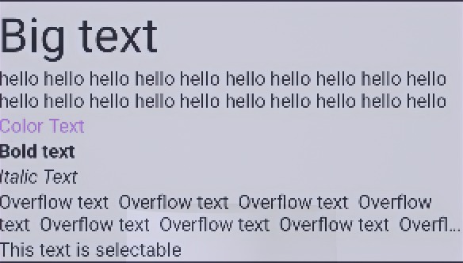

# Text en Jetpack Compose

> Aprende a usar y personalizar el composable Text en Jetpack Compose: tamaño, color, negrita, cursiva, número máximo de líneas y más.

*Básicos · 12 min de lectura*  
*Fuente base (en inglés): <https://jetpackcompose.net>*

---

## ¿Qué es Text?

Si eres desarrollador de Android clásico, equivale al componente ***TextView***.

Si eres nuevo en la programación Android, representa simplemente una ***etiqueta*** (*label*) o un ***párrafo*** de texto dentro de la interfaz.

> **Nota sobre los imports:** en los ejemplos de este documento se asume que has importado lo necesario (`androidx.compose.material3.Text`, `androidx.compose.ui.unit.sp`, `androidx.compose.ui.text.font.FontWeight`, etc.). Android Studio los sugiere automáticamente con `Alt + Enter`.

### Parámetros de la función Text

A continuación se muestran los parámetros más comunes de la firma de `Text` (versión de Material 3), con la función de cada uno. La firma completa incluye además `minLines` y `onTextLayout`.

```kotlin
Text(
    text = "Texto a mostrar",                   // El contenido de texto que se va a renderizar en pantalla.
    modifier = Modifier,                        // Modificador para aplicar tamaño, márgenes, fondos o comportamientos.
    color = Color.Unspecified,                  // Color del texto (si no se especifica, usa el del estilo).
    fontSize = TextUnit.Unspecified,            // Tamaño de la fuente, usando unidades .sp.
    fontStyle = null,                           // Define si el texto se muestra normal o inclinado (cursiva).
    fontWeight = null,                          // Grosor del trazo de la tipografía (como la negrita).
    fontFamily = null,                          // Familia tipográfica a usar (Monospace, SansSerif, etc.).
    letterSpacing = TextUnit.Unspecified,       // Espacio horizontal adicional entre cada carácter.
    textDecoration = null,                      // Decoraciones visuales como el subrayado o el tachado.
    textAlign = null,                           // Alineación horizontal del texto dentro de su contenedor.
    lineHeight = TextUnit.Unspecified,          // Altura de cada línea de texto (interlineado).
    overflow = TextOverflow.Clip,               // Comportamiento visual cuando el texto excede el espacio disponible.
    softWrap = true,                            // Si el texto salta de línea al llegar al borde del contenedor.
    maxLines = Int.MAX_VALUE,                   // Máximo de líneas que se dibujan antes de truncar el texto.
    style = LocalTextStyle.current              // Estilo tipográfico base (Material Theme o TextStyle propio).
)
```

---

## Opciones de personalización básica

### 1. Tamaño del texto

Modifica el tamaño del texto con el parámetro `fontSize`. Se debe usar la unidad `sp` (Scale-independent Pixels); de hecho, `fontSize` acepta valores `TextUnit` (`sp` o `em`), no `dp`.

```kotlin
@Composable
fun TextWithSize(label: String, size: TextUnit) {
    Text(label, fontSize = size)
}

// Ejemplo de llamada: TextWithSize("Big text", 40.sp)
```

#### Unidades de medida: dp vs sp

Para diseñar interfaces accesibles y consistentes en Android, conviene distinguir cuándo usar cada unidad:

*   **`dp` (Density-independent Pixels):** es una unidad lógica que se adapta a la densidad de píxeles de cada pantalla, de modo que un elemento mida lo mismo visualmente en cualquier dispositivo (1 dp equivale a 1 píxel en una pantalla de 160 dpi). Se usa para dimensiones estructurales: tamaño de contenedores (`Modifier.size()`), márgenes (`Modifier.padding()`), anchos (`width`), altos (`height`), radios de esquina (`RoundedCornerShape(8.dp)`), grosor de bordes, etc.
*   **`sp` (Scale-independent Pixels):** es idéntica al `dp`, pero además se multiplica por el factor de escala de fuente que el usuario elige en los ajustes del sistema. Se debe usar para el tamaño de las fuentes (`fontSize`) y el interlineado (`lineHeight`), de modo que ambos escalen juntos.

**Regla de diseño:** si un usuario aumenta el tamaño del texto en los ajustes de accesibilidad del sistema operativo, las fuentes configuradas en `sp` aumentarán su tamaño de forma dinámica. Si se configurasen en `dp` (por ejemplo, convirtiendo con `.value.sp` o mediante `LocalDensity`), el tamaño del texto permanecería fijo, lo que afectaría negativamente a la accesibilidad de la aplicación.

### 2. Color del texto

Modifica el color del texto con el parámetro `color`.

```kotlin
@Composable
fun ColorText() {
    Text("Color text", color = Color.Blue)
}
```

### 3. Texto en negrita

Usa el parámetro `fontWeight` para definir el grosor del texto.

```kotlin
@Composable
fun BoldText() {
    Text("Bold text", fontWeight = FontWeight.Bold)
}
```

### 4. Texto en cursiva

Usa el parámetro `fontStyle` para inclinar el texto (estilo itálico o cursiva).

```kotlin
@Composable
fun ItalicText() {
    Text("Italic Text", fontStyle = FontStyle.Italic)
}
```

---

## Control de extensión y estructura

### 5. Número máximo de líneas

Para limitar la cantidad de líneas visibles en un `Text` cuando el contenido es demasiado largo, se establece el parámetro `maxLines`.

```kotlin
@Composable
fun MaxLines() {
    Text("hello ".repeat(50), maxLines = 2)
}
```

### 6. Desbordamiento del texto

Al limitar la longitud de un texto, conviene indicar visualmente que el contenido se ha recortado. Para ello se configura el parámetro `overflow`, que aplica un formato de truncado (como los puntos suspensivos con `TextOverflow.Ellipsis`) únicamente si el texto supera el espacio asignado. Por defecto el valor es `TextOverflow.Clip`, que corta el texto sin ninguna indicación.

```kotlin
@Composable
fun OverflowedText() {
    Text("Hello Compose ".repeat(50), maxLines = 2, overflow = TextOverflow.Ellipsis)
}
```

### 7. Texto seleccionable

Por defecto, el composable `Text` no permite que el usuario seleccione ni copie el texto. Para habilitar la selección, se envuelve el contenido con `SelectionContainer`.

```kotlin
@Composable
fun SelectableText() {
    SelectionContainer {
        Text("This text is selectable")
    }
}
```

---

## Posicionamiento y estilos avanzados

### 8. Alineación del texto

Para alinear el texto horizontalmente dentro de los límites de su contenedor se usa el parámetro `textAlign`. Valores habituales: `TextAlign.Start`, `Center`, `End` y `Justify`. Se recomienda `Start`/`End` frente a `Left`/`Right`, porque respetan los idiomas que se escriben de derecha a izquierda.

Para que la alineación sea visible, el `Text` debe ocupar todo el ancho disponible (por ejemplo, con `Modifier.fillMaxWidth()`).

```kotlin
@Composable
fun AlignedText() {
    Text(
        text = "Texto centrado",
        modifier = Modifier.fillMaxWidth(),
        textAlign = TextAlign.Center
    )
}
```

### 9. Familias de fuentes (tipografía)

El parámetro `fontFamily` permite elegir entre las fuentes del sistema (`FontFamily.Monospace`, `SansSerif`, `Serif`, `Cursive`) o usar fuentes personalizadas cargadas desde los recursos de la aplicación (archivos `.ttf` u `.otf` en el directorio `res/font`).

```kotlin
@Composable
fun CustomFontText() {
    Text(
        text = "Texto con fuente Monospace",
        fontFamily = FontFamily.Monospace
    )
}
```

### 10. Estilos y Material Design

En lugar de definir por separado tamaño, color y demás propiedades tipográficas en cada elemento, se recomienda usar el parámetro `style`. Permite aplicar los estilos estandarizados del tema global (Material Theme) o crear estilos reutilizables mediante `TextStyle`.

```kotlin
@Composable
fun StyledText() {
    Column {
        // Estilo tipográfico del tema global de Material Design 3
        Text(
            text = "Título Principal",
            style = MaterialTheme.typography.titleLarge
        )

        // TextStyle personalizado con interlineado y espaciado de letras específicos
        Text(
            text = "Párrafo con interlineado y espaciado de letras específicos.",
            style = TextStyle(
                lineHeight = 24.sp,
                letterSpacing = 1.5.sp
            )
        )
    }
}
```

---

### Resultado general



**Documentación oficial**

<https://developer.android.com/develop/ui/compose/text>
