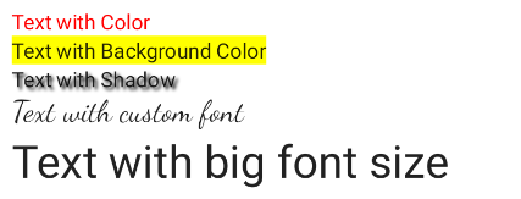
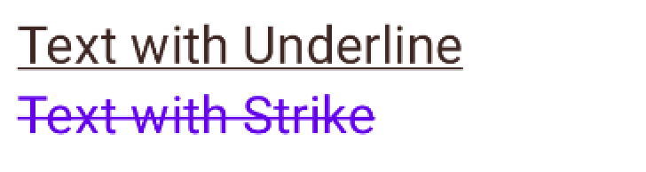
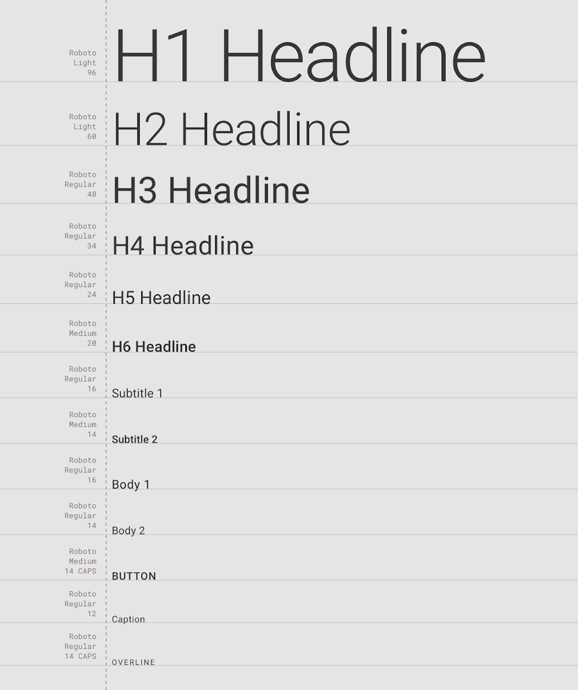
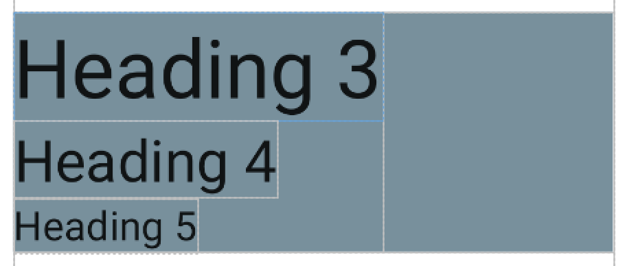

# TextStyle en Jetpack Compose

> Da estilo a tu texto con TextStyle en Jetpack Compose: color, sombra, familia tipográfica, tamaño de fuente, decoración del texto y más.

*Básicos · 30 de enero de 2024 · 7 min de lectura*  
*Fuente (en inglés): <https://www.jetpackcompose.net/textstyle-in-jetpack-compose>*

## Introducción

El texto desempeña un papel importante en las aplicaciones móviles y web: mediante él presentamos los detalles al usuario. Imaginemos que usáramos la misma fuente, el mismo color y el mismo tamaño en todo este blog: no quedaría bien y los usuarios no podrían entenderlo. Por eso necesitamos dar estilo a este widget con la opción TextStyle para mejorar la experiencia de usuario.

En Jetpack Compose podemos usar las siguientes opciones para aplicar un `TextStyle()`:

```kotlin
Text(
    text = "Hello World",
    style = TextStyle(
        color = Color.Red,
        fontSize = 16.sp,
        fontFamily = FontFamily.Monospace,
        fontWeight = FontWeight.W800,
        fontStyle = FontStyle.Italic,
        letterSpacing = 0.5.em,
        background = Color.LightGray,
        textDecoration = TextDecoration.Underline
    )
)
```

## 1. Color del texto

```kotlin
Text(
    text = "Text with Color",
    style = TextStyle(color = Color.Red)
)
```

## 2. Color de fondo

```kotlin
Text(
    text = "Text with Background Color",
    style = TextStyle(background = Color.Yellow)
)
```

## 3. Sombra

```kotlin
Text(
    text = "Text with Shadow",
    style = TextStyle(
        shadow = Shadow(
            color = Color.Black,
            offset = Offset(5f, 5f),
            blurRadius = 5f
        )
    )
)
```

## 4. Familia tipográfica (Font Family)

Puedes usar las siguientes fuentes del sistema o tu propia fuente personalizada.

```kotlin
val Default: SystemFontFamily = DefaultFontFamily()
val SansSerif = GenericFontFamily("sans-serif")
val Serif = GenericFontFamily("serif")
val Monospace = GenericFontFamily("monospace")
val Cursive = GenericFontFamily("cursive")
```

**Ejemplo:**

```kotlin
Text(
    text = "Text with custom font",
    style = TextStyle(fontSize = 20.sp, fontFamily = FontFamily.Cursive)
)
```

## 5. Tamaño de fuente

```kotlin
Text(
    text = "Text with big font size",
    style = TextStyle(fontSize = 30.sp)
)
```

## 6. Estilo de fuente

Puedes usar **FontStyle.Normal** o **FontStyle.Italic**.

```kotlin
Text(
    text = "Text with Italic text",
    style = TextStyle(fontSize = 20.sp, fontStyle = FontStyle.Italic)
)
```

## Resultado



## 7. Decoración del texto

Puedes usar **TextDecoration.Underline** o **TextDecoration.LineThrough**.

`TextDecoration.Underline`: dibuja una línea horizontal debajo del texto.  
`TextDecoration.LineThrough`: dibuja una línea horizontal que atraviesa el texto.

```kotlin
@Composable
fun TextDecorationStyle() {
    Column {
        Text(
            text = "Text with Underline",
            style = TextStyle(
                color =  Color.Black, fontSize = 24.sp,
                textDecoration = TextDecoration.Underline
            )
        )
        Text(
            text = "Text with Strike",
            style = TextStyle(
                color =  Color.Blue, fontSize = 24.sp,
                textDecoration = TextDecoration.LineThrough
            )
        )
    }
}
```



## Tipografía (Typography)

A partir de `MaterialTheme` podemos reutilizar la tipografía predeterminada, que ofrece distintos `TextStyle()` con varios tamaños de texto.

Estas son las opciones disponibles en la tipografía de Material Theme:



**Código de ejemplo:**

```kotlin
@Composable
fun TextHeadingStyle() {
    Column(
        modifier = Modifier
            .fillMaxWidth()
            .background(Color.Green)
    ) {
        Text(
            text = "Heading 3",
            style = MaterialTheme.typography.h3
        )
        Text(
            text = "Heading 4",
            style = MaterialTheme.typography.h4
        )
        Text(
            text = "Heading 5",
            style = MaterialTheme.typography.h5
        )
    }
}
```

**Resultado:**



## Código fuente

<https://github.com/JetpackCompose/Jetpack-Compose-Samples>
