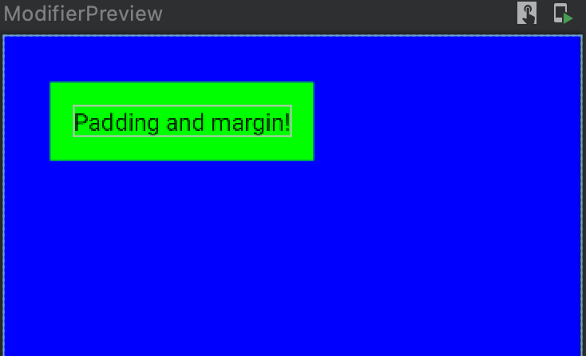
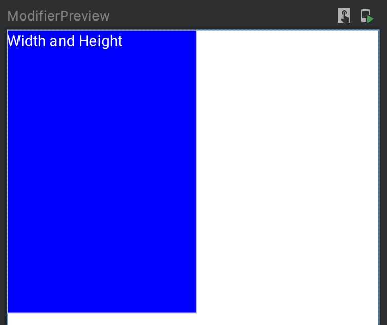
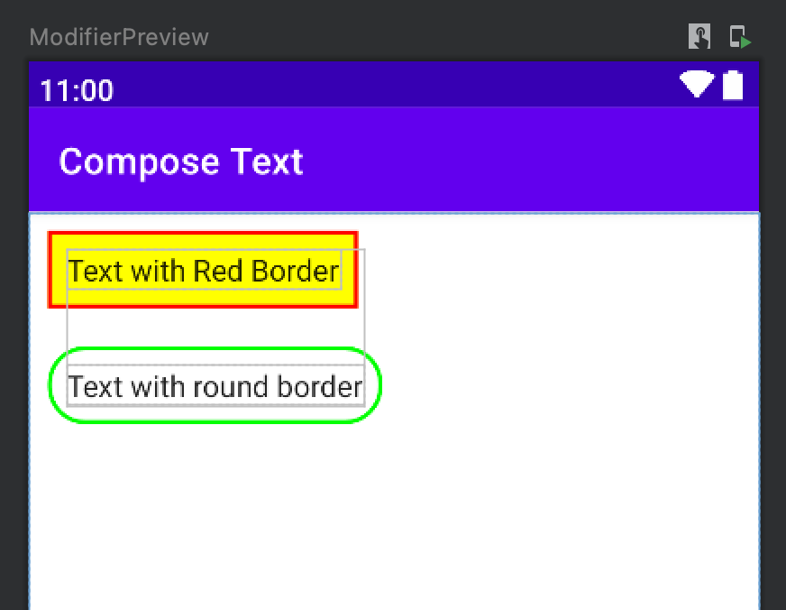

# Modificadores (Modifiers) en Jetpack Compose

> Domina los modificadores de Jetpack Compose: fondo, padding, tamaño, alpha, rotación, escala, weight, borde, recorte y más.

*Básicos · Actualizado · 12 min de lectura*  
Fuente base (en inglés): <https://jetpackcompose.net>

---

## ¿Qué son los modificadores (Modifiers) en Jetpack Compose?

Los elementos `Modifier` decoran o añaden comportamiento a los componentes visuales de la interfaz de Compose. Por ejemplo, los fondos, el espaciado y los gestos de interacción decoran o añaden lógica a filas, columnas, textos o botones.

1.  Permiten definir dimensiones y espaciados.
2.  Ayudan a posicionar los componentes dentro de un layout o contenedor.
3.  Modifican el aspecto visual y la estética de la interfaz.

> **Nota para desarrolladores de Android clásico:** La gran mayoría de los atributos definidos en los archivos XML tradicionales (`id`, `padding`, `margin`, `background`, `alpha`, `elevation`, etc.) se aplican ahora mediante modificadores.

---

### Cómo se estructura un Modifier (Sintaxis de encadenamiento)

En Jetpack Compose, un modificador no es una función convencional con parámetros únicos, sino un objeto que se construye encadenando métodos de forma consecutiva mediante puntos. La estructura que se utiliza en el código sigue este patrón:

```kotlin
Modifier
    .background(Color.Blue) // 1. Primero se aplica el fondo
    .padding(16.dp)        // 2. Después se aplica el espacio interno
    .fillMaxWidth()        // 3. Finalmente se expande al ancho máximo
```

> **Regla fundamental:** El orden en el que se encadenan los modificadores altera por completo el resultado visual en la pantalla, ya que cada método modifica el área delimitada por el paso anterior.

---

## Opciones de Personalización y Diseño

### 1. Color de fondo
Aplica un color plano al fondo del componente utilizando el método `.background()`.

```kotlin
Text(
    text = "Text with green background color",
    modifier = Modifier.background(color = Color.Green)
)
```

### 2. Padding (Márgenes y Rellenos)
Jetpack Compose no dispone de un modificador específico llamado `margin`. Se utiliza el modificador `.padding()` de forma consecutiva tanto para el relleno interno como para el margen externo, dependiendo de su posición respecto al fondo.

```kotlin
@Composable
fun TextWidthPadding() {
    Text(
        text = "Padding and margin!",
        modifier = Modifier
            .padding(32.dp)                 // Funciona como Margen Externo (antes del fondo)
            .background(color = Color.Green) // Color de fondo aplicado al área actual
            .padding(16.dp)                 // Funciona como Relleno Interno (después del fondo)
    )
}
```



### 3. Ancho y alto
Para definir dimensiones fijas e independientes en los ejes horizontal y vertical, se utilizan los métodos `.width()` and `.height()`.

```kotlin
@Composable
fun WidthAndHeightModifier() {
    Text(
        text = "Width and Height",
        color = Color.White,
        modifier = Modifier
            .background(Color.Blue)
            .width(200.dp)
            .height(300.dp)
    )
}
```



### 4. Size (Tamaño combinado)
Cuando se requiere asignar ancho y alto de forma simultánea en la misma instrucción, se utiliza `.size()`.
*   Si el ancho y el alto deben ser iguales, se pasa un único valor: `.size(200.dp)`.
*   Si se requieren dimensiones distintas, se especifican ambos parámetros: `.size(width = 200.dp, height = 100.dp)`.

```kotlin
@Composable
fun SizeModifier() {
    Text(
        text = "Text with Size",
        color = Color.White,
        modifier = Modifier
            .background(Color.Cyan)
            .size(width = 250.dp, height = 100.dp)
    )
}
```

### 5. Fill Max Width (Ancho máximo adaptable)
Expande el componente horizontalmente ocupando el espacio disponible en base a una fracción comprendida entre `0.0` (0%) y `1.0` (100%). Equivale al comportamiento tradicional de `match_parent`. Si no se especifica una fracción, toma el valor `1.0` por defecto.

```kotlin
@Composable
fun FillWidthModifier() {
    Text(
        text = "Text Width Match Parent",
        color = Color.White,
        modifier = Modifier
            .background(Color.Gray)
            .padding(10.dp)
            .fillMaxWidth(1f) // Ocupa el 100% del ancho del contenedor padre
    )
}
```

### 6. Fill Max Height (Alto máximo adaptable)
Expande el componente verticalmente ocupando el espacio disponible basándose en una fracción comprendida entre `0.0` y `1.0`.

```kotlin
@Composable
fun FillHeightModifier() {
    Text(
        text = " Text with 75% Height ",
        color = Color.White,
        modifier = Modifier
            .background(Color.Green)
            .fillMaxHeight(0.75f) // Ocupa el 75% del alto disponible
    )
}
```

---

## Transformaciones Gráficas

### 7. Alpha (Opacidad)
Controla la transparencia del componente visual mediante un valor flotante de `0.0` (completamente invisible) a `1.0` (completamente opaco).

```kotlin
@Composable
fun AlphaModifier() {
    Box(
        modifier = Modifier
            .size(250.dp)
            .alpha(0.5f) // 50% de opacidad visual
            .background(Color.Red)
    )
}
```

### 8. Rotate (Rotación)
Gira la interfaz los grados indicados tomando como eje el centro del componente. Los valores positivos realizan un giro en sentido horario, mientras que los valores negativos lo hacen en sentido antihorario.

```kotlin
@Composable
fun RotateModifier() {
    Box(
        modifier = Modifier
            .rotate(45f) // Gira 45 grados en sentido horario
            .size(250.dp)
            .background(Color.Red)
    )
}
```

### 9. Scale (Escala)
Aumenta o reduce el tamaño visual del contenido multiplicándolo por los factores especificados en los ejes `scaleX` y `scaleY`. Los valores negativos provocan un efecto de espejo horizontal o vertical.

```kotlin
@Composable
fun ScaleModifier() {
    Box(
        modifier = Modifier
            .scale(scaleX = 2f, scaleY = 3f) // Multiplica por 2 el ancho y por 3 el alto original
            .size(200.dp, 200.dp)
    )
}
```

---

## Estructura y Estilo Avanzado

### 10. Weight (Distribución proporcional de peso)
Permite repartir de manera proporcional el espacio disponible entre varios componentes distribuidos linealmente. 
> **Nota técnica importante:** Este modificador solo está disponible cuando el componente se encuentra directamente dentro del ámbito (*scope*) de un contenedor lineal (`Row` o `Column`).

```kotlin
@Composable
fun WeightModifier(){
    Row {
        Column(
            modifier = Modifier.weight(1f).background(Color.Red)
        ){
            Text(text = "Sección 1 (25%)", color = Color.White)
        }
        Column(
            modifier = Modifier.weight(1f).background(Color.Blue)
        ){
            Text(text = "Sección 2 (25%)", color = Color.White)
        }
        Column(
            modifier = Modifier.weight(2f).background(Color.Green)
        ) {
            Text(text = "Sección 3 (50%)")
        }
    }
}
```

### 11. Border (Contornos y Bordes)
Permite trazar líneas periféricas alrededor del límite del componente indicando su grosor, color, pincel o geometría. Dispone de tres firmas comunes:
1.  `Modifier.border(width: Dp, color: Color, shape: Shape = RectangleShape)`
2.  `Modifier.border(width: Dp, brush: Brush, shape: Shape)`
3.  `Modifier.border(border: BorderStroke, shape: Shape = RectangleShape)`

```kotlin
@Composable
fun BorderModifier() {
    Text(
        text = "Text with Red Border",
        modifier = Modifier
            .padding(10.dp)
            .background(Color.Yellow)
            .border(2.dp, Color.Red)
            .padding(10.dp)
    )
}
```

#### Contorno con esquinas redondeadas
```kotlin
@Composable
fun BorderWithShape() {
    Text(
        text = "Text with round border",
        modifier = Modifier
            .padding(10.dp)
            .border(2.dp, SolidColor(Color.Green), RoundedCornerShape(20.dp))
            .padding(10.dp)
    )
}
```



### 12. Clip (Recorte geométrico)
El modificador `.clip()` restringe el área visual del componente y sus componentes hijos según una forma determinada. Las formas geométricas estándar integradas en Compose son:
*   `RectangleShape` (Rectángulo básico)
*   `CircleShape` (Círculo perfecto)
*   `RoundedCornerShape` (Esquinas redondeadas)
*   `CutCornerShape` (Esquinas achaflanadas o cortadas en línea recta)

```kotlin
@Composable
fun ClipModifier() {
    Text(
        text = "Text with Clipped background",
        color = Color.White,
        modifier = Modifier
            .padding(10.dp)
            .clip(RoundedCornerShape(25.dp)) // Recorta las esquinas del fondo
            .background(Color.Blue)
            .padding(15.dp)
    )
}
```

---

**Código fuente y recursos adicionales**

<https://github.com>
