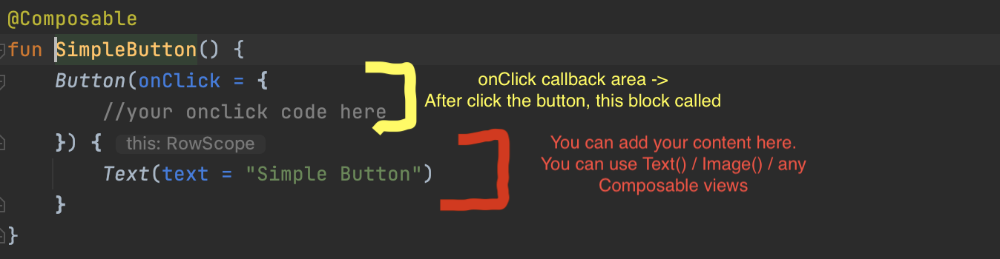
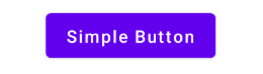
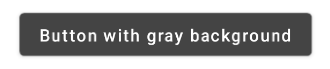
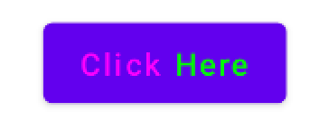
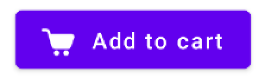
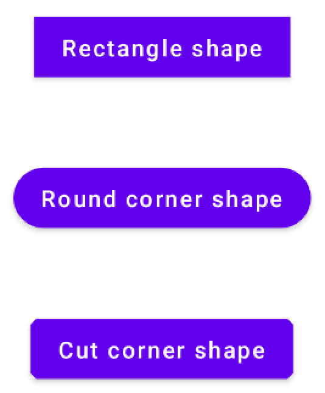
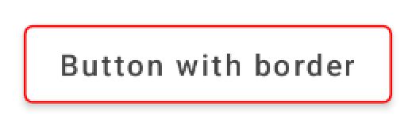
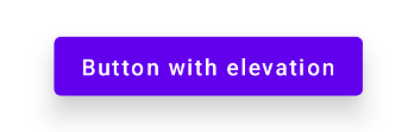

# Botones (Buttons) en Jetpack Compose

> Aprende a crear distintos tipos de botones en Jetpack Compose: simples, de color, con iconos, con formas, con bordes y con elevación.

*Básicos · 5 de febrero de 2024 · 8 min de lectura*  
*Fuente (en inglés): <https://www.jetpackcompose.net/buttons-in-jetpack-compose>*

En los botones de Jetpack Compose debes proporcionar dos argumentos. El primero es el callback `onClick` y el otro es el elemento de texto del botón. Puedes añadir un composable `Text` o cualquier otro composable como elementos hijos del `Button`.



## 1. Botón simple

```kotlin
@Composable
fun SimpleButton() {
    Button(onClick = {
        //your onclick code here
    }) {
        Text(text = "Simple Button")
    }
}
```



## 2. Botón con color personalizado

```kotlin
@Composable
fun ButtonWithColor(){
    Button(onClick = {
        //your onclick code
        },
        colors = ButtonDefaults.buttonColors(backgroundColor = Color.DarkGray))
    {
     Text(text = "Button with gray background",color = Color.White)
    }
}
```



## 3. Botón con varios textos

```kotlin
@Composable
fun ButtonWithTwoTextView() {
    Button(onClick = {
        //your onclick code here
    }) {
        Text(text = "Click ", color = Color.Magenta)
        Text(text = "Here", color = Color.Green)
    }
}
```



## 4. Botón con icono

```kotlin
@Composable
fun ButtonWithIcon() {
    Button(onClick = {}) {
        Image(
            painterResource(id = R.drawable.ic_cart),
            contentDescription ="Cart button icon",
            modifier = Modifier.size(20.dp))

        Text(text = "Add to cart",Modifier.padding(start = 10.dp))
    }
}
```



## 5. Botones con formas

**Forma rectangular (Rectangle Shape):**

```kotlin
@Composable
fun ButtonWithRectangleShape() {
    Button(onClick = {}, shape = RectangleShape) {
        Text(text = "Rectangle shape")
    }
}
```

**Esquinas redondeadas (Round Corner Shape):**

```kotlin
@Composable
fun ButtonWithRoundCornerShape() {
    Button(onClick = {}, shape = RoundedCornerShape(20.dp)) {
        Text(text = "Round corner shape")
    }
}
```

**Esquinas cortadas (Cut Corner Shape):**

```kotlin
@Composable
fun ButtonWithCutCornerShape() {
    //CutCornerShape(percent: Int)- it will consider as percentage
    //CutCornerShape(size: Dp)- you can pass Dp also.
    Button(onClick = {}, shape = CutCornerShape(10)) {
        Text(text = "Cut corner shape")
    }
}
```



## 6. Botón con borde

```kotlin
@Composable
fun ButtonWithBorder() {
    Button(
        onClick = {
            //your onclick code
        },
        border = BorderStroke(1.dp, Color.Red),
        colors = ButtonDefaults.outlinedButtonColors(contentColor = Color.Red)
    ) {
        Text(text = "Button with border", color = Color.DarkGray)
    }
}
```



## 7. Elevación del botón

```kotlin
@Composable
fun ButtonWithElevation() {
    Button(onClick = {
        //your onclick code here
    },elevation =  ButtonDefaults.elevation(
        defaultElevation = 10.dp,
        pressedElevation = 15.dp,
        disabledElevation = 0.dp
    )) {
        Text(text = "Button with elevation")
    }
}
```



## Código fuente

<https://github.com/JetpackCompose/Jetpack-Compose-Samples>
