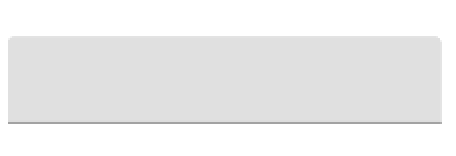

# TextField en Jetpack Compose

> Aprende a crear campos de entrada de texto en Jetpack Compose: simples, con etiquetas, con opciones de teclado, con contorno (outlined) y con iconos.

*Básicos · 10 de febrero de 2024 · 10 min de lectura*  
*Fuente (en inglés): <https://www.jetpackcompose.net/textfield-in-jetpack-compose>*

**¿Qué es TextField?**

TextField es un control de interfaz de usuario que permite al usuario introducir texto. Este widget se utiliza para obtener datos del usuario, ya sean números o texto.

Un ejemplo sencillo de TextField es una pantalla de inicio de sesión (login).

Obtenemos el nombre de usuario y la contraseña mediante el widget TextField.

> *Si eres desarrollador de Android:* es el `EditText`.

**¿Qué opciones hay disponibles en TextField?** Estos son los argumentos disponibles en la función `TextField`:

```kotlin
@Composable
fun TextField(
    value: TextFieldValue,
    onValueChange: (TextFieldValue) -> Unit,
    modifier: Modifier = Modifier,
    enabled: Boolean = true,
    readOnly: Boolean = false,
    textStyle: TextStyle = LocalTextStyle.current,
    label: @Composable (() -> Unit)? = null,
    placeholder: @Composable (() -> Unit)? = null,
    leadingIcon: @Composable (() -> Unit)? = null,
    trailingIcon: @Composable (() -> Unit)? = null,
    isError: Boolean = false,
    visualTransformation: VisualTransformation = VisualTransformation.None,
    keyboardOptions: KeyboardOptions = KeyboardOptions.Default,
    keyboardActions: KeyboardActions = KeyboardActions(),
    singleLine: Boolean = false,
    maxLines: Int = Int.MAX_VALUE,
    interactionSource: MutableInteractionSource = remember { MutableInteractionSource() },
    shape: Shape =
        MaterialTheme.shapes.small.copy(bottomEnd = ZeroCornerSize, bottomStart = ZeroCornerSize),
    colors: TextFieldColors = TextFieldDefaults.textFieldColors()
)
```

## 1. TextField simple

```kotlin
@Composable
fun SimpleTextField() {
    var text by remember { mutableStateOf(TextFieldValue("")) }
    TextField(
        value = text,
        onValueChange = { newText ->
            text = newText
        }
    )
}
```

En este ejemplo creamos una variable **text**, que es un **mutableState** de **TextFieldValue**.

- **mutableState**: devuelve un valor observable para Compose. Si el valor cambia, la interfaz se actualiza automáticamente.
- **TextFieldValue**: una clase que contiene información sobre el estado de edición.

**Resultado:**



Crea un cuadro de texto simple, pero sin ninguna etiqueta, y la interfaz tampoco queda demasiado bien. Veremos otras opciones para mejorarlo.

## 2. Label y placeholder

```kotlin
@Composable
fun LabelAndPlaceHolder() {
    var text by remember { mutableStateOf(TextFieldValue("")) }
    TextField(
        value = text,
        onValueChange = {
            text = it
        },
        label = { Text(text = "Your Label") },
        placeholder = { Text(text = "Your Placeholder/Hint") },
    )
}
```

- `label`: si el TextField tiene el foco, la etiqueta se desplaza flotando a la parte superior del TextField.
- `placeholder`: muestra un texto descriptivo dentro del cuadro cuando el TextField está vacío.

## 3. Opciones de teclado (Keyboard Options)

```kotlin
@Composable
fun TextFieldWithInputType() {
    var text by remember { mutableStateOf(TextFieldValue("")) }
    TextField(
        value = text,
        label = { Text(text = "Number Input Type") },
        keyboardOptions = KeyboardOptions(keyboardType = KeyboardType.Number),
        onValueChange = { it ->
            text = it
        }
    )
}
```

Para obtener una entrada numérica desde un TextField, usa `keyboardOptions`. Aquí usamos el tipo de teclado numérico, de modo que se muestra un teclado para introducir números.

Estos son los tipos de teclado (`KeyboardType`) disponibles en Compose:

- `KeyboardType.Text`
- `KeyboardType.Ascii`
- `KeyboardType.Number`
- `KeyboardType.Phone`
- `KeyboardType.Uri`
- `KeyboardType.Email`
- `KeyboardType.Password`
- `KeyboardType.NumberPassword`

## 4. TextField con contorno (OutlinedTextField)

```kotlin
@Composable
fun OutLineTextFieldSample() {
    var text by remember { mutableStateOf(TextFieldValue("")) }
    OutlinedTextField(
        value = text,
        label = { Text(text = "Enter Your Name") },
        onValueChange = {
            text = it
        }
    )
}
```

Es un componente de Jetpack Material. En lugar de la función ***TextField()*** usamos ***OutlinedTextField()***.

Crea un bonito borde de contorno para tu TextField.

## 5. TextField con iconos

```kotlin
@Composable
fun TextFieldWithIcons() {
    var text by remember { mutableStateOf(TextFieldValue("")) }
    return OutlinedTextField(
        value = text,
        leadingIcon = { Icon(imageVector = Icons.Default.Email, contentDescription = "emailIcon") },
        //trailingIcon = { Icon(imageVector = Icons.Default.Add, contentDescription = null) },
        onValueChange = {
            text = it
        },
        label = { Text(text = "Email address") },
        placeholder = { Text(text = "Enter your e-mail") },
    )
}
```

- `leadingIcon`: añade un icono en la zona inicial (al principio del campo).
- `trailingIcon`: añade un icono en la zona final (al final del campo).

**Código fuente:**

<https://github.com/JetpackCompose/Jetpack-Compose-Samples>
