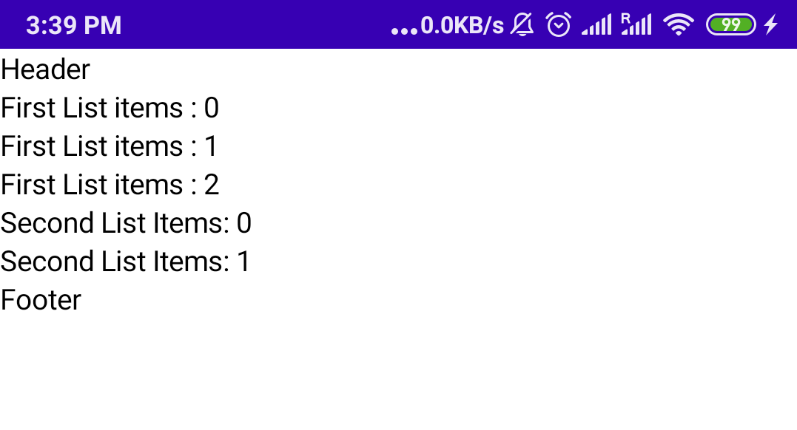
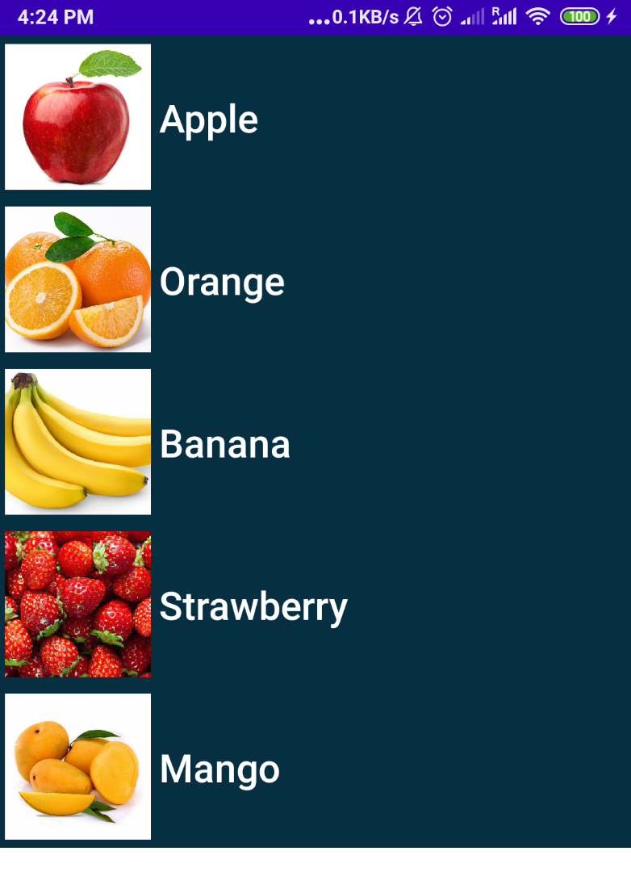

# LazyColumn y LazyRow

> Aprende a crear listas con desplazamiento eficientes en Jetpack Compose con LazyColumn y LazyRow, el equivalente de RecyclerView.

*Básicos · 12 de febrero de 2024 · 8 min de lectura*  
*Fuente (en inglés): <https://www.jetpackcompose.net/lazycolumn-and-lazyrow>*

## Composables Lazy

Si necesitas mostrar un gran número de elementos (o una lista de longitud desconocida), usar un layout como `Column` puede causar problemas de rendimiento, ya que se compondrán y se colocarán todos los elementos, sean visibles o no.

Compose ofrece un conjunto de componentes que solo componen y colocan los elementos visibles en el viewport del componente. Entre ellos están `LazyColumn` y `LazyRow`.

**LazyColumn**: genera una lista con desplazamiento vertical.  
**LazyRow**: genera una lista con desplazamiento horizontal.

> *Para desarrolladores de Android:* **LazyColumn** equivale a un RecyclerView vertical y **LazyRow** a un RecyclerView horizontal.

## LazyColumn

En `LazyColumn` puedes añadir `item()` o `items()`. Para un único composable usa `item()`. Para una lista de composables usa `items(count: Int)` o `items(items: List<T>)`.

```kotlin
@Composable
fun ListListScopeSample(){
    LazyColumn {
        // Add a single item
        item {
            Text(text = "Header")
        }

        // Add 3 items
        items(3) { index ->
            Text(text = "First List items : $index")
        }

        // Add 2 items
        items(2) { index ->
            Text(text = "Second List Items: $index")
        }

        // Add another single item
        item {
            Text(text = "Footer")
        }
    }
}
```

**Resultado:**



## 1. Lista simple

```kotlin
private val countryList =
    mutableListOf("India", "Pakistan", "China", "United States")

private val listModifier = Modifier
    .fillMaxSize()
    .background(Color.Gray)
    .padding(10.dp)

private val textStyle = TextStyle(fontSize = 20.sp, color = Color.White)

@Composable
fun SimpleListView() {
    LazyColumn(modifier = listModifier) {
        items(countryList) { country ->
            Text(text = country, style = textStyle)
        }
    }
}
```

En este ejemplo usamos una lista de países y la recorremos con `items(items: List<T>)`.

## 2. Lista personalizada

Vamos a mostrar una lista de nombres de frutas con su imagen.

**Paso 1: crear una data class**

```kotlin
data class FruitModel(val name:String, val image : Int)
```

**Paso 2: crear una fila personalizada (función Composable)**

```kotlin
@Composable
fun ListRow(model: FruitModel) {
    Row(
        verticalAlignment = Alignment.CenterVertically,
        modifier = Modifier
            .wrapContentHeight()
            .fillMaxWidth()
            .background("#063041".color)
    ) {
        Image(
            painter = painterResource(id = model.image),
            contentDescription = "",
            contentScale = ContentScale.Crop,
            modifier = Modifier
                .size(100.dp)
                .padding(5.dp)
        )
        Text(
            text = model.name,
            fontSize = 24.sp,
            fontWeight = FontWeight.SemiBold,
            color = Color.White
        )
    }
}
```

**Paso 3: crear una mutableList para añadir la lista de modelos de frutas**

```kotlin
private val fruitsList = mutableListOf<FruitModel>()
```

**Paso 4: añadir elementos a la lista**

```kotlin
fruitsList.add(FruitModel("Apple", R.drawable.apple))
fruitsList.add(FruitModel("Orange", R.drawable.orange))
fruitsList.add(FruitModel("Banana", R.drawable.banana))
fruitsList.add(FruitModel("Strawberry", R.drawable.strawberry))
fruitsList.add(FruitModel("Mango", R.drawable.mango))
```

**Paso 5: usar LazyColumn para mostrar la lista**

```kotlin
LazyColumn(
    modifier = Modifier
        .fillMaxSize()
        .background(Color.White)
) {
    items(fruitsList) { model ->
        ListRow(model = model)
    }
}
```

**Resultado:**



## 3. Content Padding (relleno del contenido)

A veces necesitarás añadir padding alrededor de los bordes del contenido. Los componentes lazy permiten pasar un `PaddingValues` al parámetro `contentPadding` para conseguirlo:

```kotlin
LazyColumn(
  contentPadding = PaddingValues(horizontal = 16.dp, vertical = 8.dp),
) {
    // ...
}
```

## 4. Content Spacing (espaciado entre elementos)

Para añadir espacio entre los elementos puedes usar `Arrangement.spacedBy()`. El siguiente ejemplo añade 4.dp de espacio entre cada elemento:

```kotlin
LazyColumn(
    verticalArrangement = Arrangement.spacedBy(4.dp),
) {
    // ...
}
```
