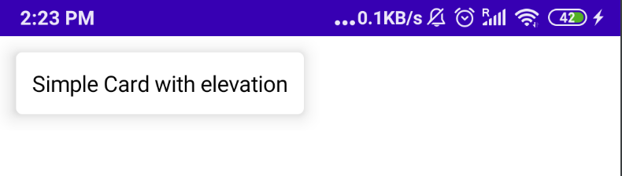
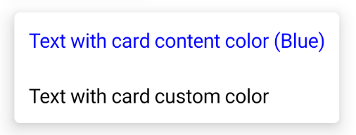

# Card en Jetpack Compose

> Aprende a usar el composable Card en Jetpack Compose: elevación, formas, bordes, varias vistas y color del contenido.

*Básicos · 12 de febrero de 2024 · 5 min de lectura*  
*Fuente (en inglés): <https://www.jetpackcompose.net/card-in-jetpack-compose>*

## ¿Qué es Card?

Card es un contenedor en el que podemos colocar un único composable. Tiene la propiedad de elevación (`elevation`), con la que podemos mostrar un efecto de sombra. También podemos añadirle un borde con las esquinas redondeadas.

> *Si eres desarrollador de Android:* es un **CardView**.

**Estas son las propiedades que podemos usar en Card:**

```kotlin
@Composable
fun Card(
    modifier: Modifier = Modifier,
    shape: Shape = MaterialTheme.shapes.medium,
    backgroundColor: Color = MaterialTheme.colors.surface,
    contentColor: Color = contentColorFor(backgroundColor),
    border: BorderStroke? = null,
    elevation: Dp = 1.dp,
    content: @Composable () -> Unit
)
```

**Sintaxis:**

```kotlin
Card(){
  AnyComposableFunction()
}
```

## 1. Card con elevación (sombra)

```kotlin
@Composable
fun SimpleCard(){
    val paddingModifier = Modifier.padding(10.dp)
    Card(elevation = 10.dp, modifier = paddingModifier) {
      Text(text = "Simple Card with elevation",
           modifier = paddingModifier)
    }
}
```

Le damos una elevación de 10.dp, así que muestra una sombra de 10.dp. También aplicamos el modificador de padding tanto al Card como al texto.

**Resultado:**



## 2. Card con forma (shape)

Podemos definir la forma del fondo del Card. Si no se indica ninguna, usará `RoundedCornerShape` con un radio de 4dp. Puedes usar las siguientes formas:

- `RectangleShape`
- `CircleShape`
- `RoundedCornerShape`
- `CutCornerShape`

```kotlin
@Composable
fun CardWithShape() {
    val paddingModifier = Modifier.padding(10.dp)
    Card(shape = RoundedCornerShape(20.dp), elevation = 10.dp, modifier = paddingModifier) {
        Text(text = "Round corner shape", modifier = paddingModifier)
    }
}
```

**Resultado:**


## 3. Card con borde

Usamos la propiedad `border`, para la que hay que indicar un `BorderStroke`. `BorderStroke` tiene dos parámetros: el primero es el grosor del borde y el segundo, su color.

```kotlin
@Composable
fun CardWithBorder() {
    val paddingModifier = Modifier.padding(10.dp)
    Card(
        elevation = 10.dp,
        border = BorderStroke(1.dp, Color.Blue),
        modifier = paddingModifier
    ) {
        Text(text = "Card with blue border", modifier = paddingModifier)
    }
}
```

**Resultado:**


## 4. Varias vistas

Card está pensado para contener un único composable. Si quieres varios widgets en el mismo Card, debes usar otros composables de layout como `Column`, `Row` o `ConstraintLayout`.

```kotlin
@Composable
fun CardWithMultipleViews() {
    val paddingModifier = Modifier.padding(10.dp)
    Card(
        elevation = 10.dp,
        modifier = paddingModifier
    ) {
        Column(modifier = paddingModifier) {
            Text(text = "First Text")
            Text(text = "Second Text")
        }
    }
}
```

**Resultado:**


## 5. Color del contenido (Content Color)

En la programación Android tradicional no existe esta propiedad. Si la establecemos, cambiará el color del contenido de todas sus vistas hijas.

```kotlin
@Composable
fun CardWithContentColor() {
    val paddingModifier = Modifier.padding(10.dp)
    Card(
        elevation = 10.dp,
        contentColor = Color.Blue,
        modifier = paddingModifier
    ) {
        Column() {
            Text(text = "Text with card content color (Blue)",
                modifier = paddingModifier)
            Text(text = "Text with card custom color",
                color = Color.Black,
                modifier = paddingModifier)
        }
    }
}
```

En este ejemplo usamos dos `Text()`. En el primero no indicamos ningún color, así que toma el de **contentColor**. En el otro usamos la propiedad `color`, así que toma el color que se le ha indicado a él mismo.

**Resultado:**


