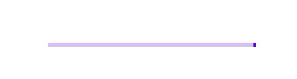
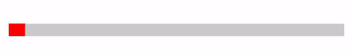
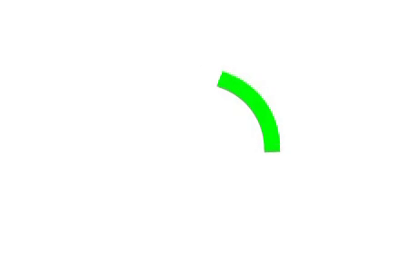

# Progress Indicator en Jetpack Compose

> Aprende a usar LinearProgressIndicator y CircularProgressIndicator en Jetpack Compose, en modo determinado e indeterminado.

*Básicos · 18 de febrero de 2024 · 6 min de lectura*  
*Fuente (en inglés): <https://www.jetpackcompose.net/progress-indicator-in-jetpack-compose>*

## Progress Indicator (indicador de progreso)

Progress Indicator es un widget que indica al usuario que hay alguna acción en curso.

En operaciones largas, como descargar o subir archivos o hacer llamadas a una API, podemos avisar al usuario de que espere con ayuda de este componente.

> *Si eres desarrollador de Android:* es un **ProgressBar**.

**Tipos de indicadores de progreso disponibles en Jetpack Compose:**

1. `LinearProgressIndicator`
2. `CircularProgressIndicator`

## LinearProgressIndicator

Se utiliza para mostrar el progreso en una línea.

Admite dos modos para representar el progreso: **determinado** (*determinate*) e **indeterminado** (*indeterminate*).

### 1. Progreso indeterminado

Si no sabes cuánto tardará tu acción, usa el modo **indeterminado**. Se ejecutará indefinidamente.

**Ejemplo:**

```kotlin
LinearProgressIndicator()
```

**Resultado:**



### 2. Progreso determinado

Usa el modo determinado cuando quieras mostrar que se ha completado una cantidad concreta de progreso. Por ejemplo, el porcentaje descargado de un archivo.

Debes indicar el valor del progreso como parámetro. Tiene que estar entre 0.0 y 1.0.

**Ejemplo:**

```kotlin
LinearProgressIndicator(progress = 0.7f) //70% progress
```

**Resultado:**


### 3. LinearProgressIndicator personalizado

Puedes personalizar el tamaño, el color del progreso, el color de fondo, etc.

**Ejemplo:**

```kotlin
@Composable
private fun CustomLinearProgressBar(){
    Column(modifier = Modifier.fillMaxWidth()) {
        LinearProgressIndicator(
            modifier = Modifier
                .fillMaxWidth()
                .height(15.dp),
            backgroundColor = Color.LightGray,
            color = Color.Red //progress color
       )
    }
}
```

**Resultado:**



## CircularProgressIndicator

Se utiliza para mostrar el progreso con forma circular. También admite dos modos: **determinado** (*determinate*) e **indeterminado** (*indeterminate*).

### 1. Progreso indeterminado

**Ejemplo:**

```kotlin
CircularProgressIndicator()
```

**Resultado:**


### 2. Progreso determinado

**Ejemplo:**

```kotlin
CircularProgressIndicator(progress = 0.75f) //75% progress
```

**Resultado:**


Por defecto no se anima, pero podemos animarlo con ayuda de las animaciones de Jetpack Compose.

### 3. Progreso determinado con animación

**Ejemplo:**

```kotlin
@Composable
private fun CircularProgressAnimated(){
    val progressValue = 0.75f
    val infiniteTransition = rememberInfiniteTransition()

    val progressAnimationValue by infiniteTransition.animateFloat(
        initialValue = 0.0f,
        targetValue = progressValue,
        animationSpec = infiniteRepeatable(animation = tween(900))
    )

    CircularProgressIndicator(progress = progressAnimationValue)
}
```

**Resultado:**


### 4. CircularProgressIndicator personalizado

Podemos personalizar el color del indicador, el grosor del trazo (*stroke width*), el ancho y el alto.

**Ejemplo:**

```kotlin
@Composable
private fun CustomCircularProgressBar(){
    CircularProgressIndicator(
        modifier = Modifier.size(100.dp),
        color = Color.Green,
        strokeWidth = 10.dp
    )
}
```

**Resultado:**



**Código fuente:** [GitHub](https://github.com/JetpackCompose/Jetpack-Compose-Samples/blob/master/JetPackComposeSamples/app/src/main/java/net/jetpackcompose/composetext/activities/ActivityProgressIndicator.kt)

**Documentación oficial:** <https://developer.android.com/reference/kotlin/androidx/compose/material/package-summary#linearprogressindicator>
