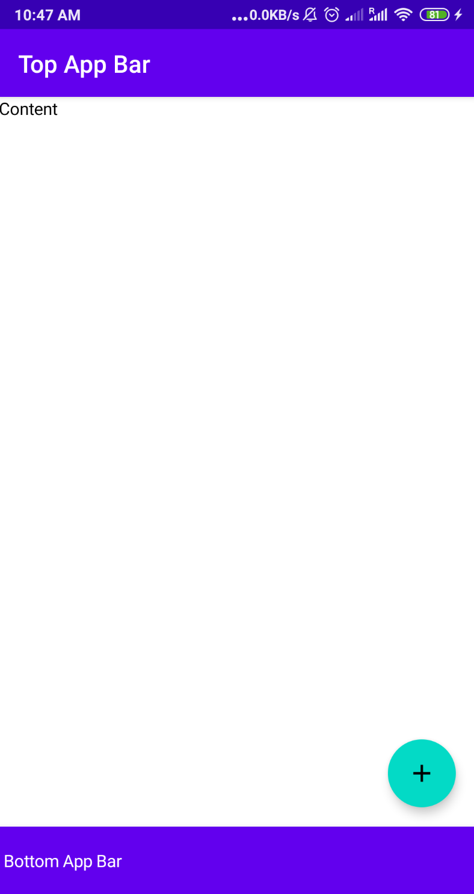
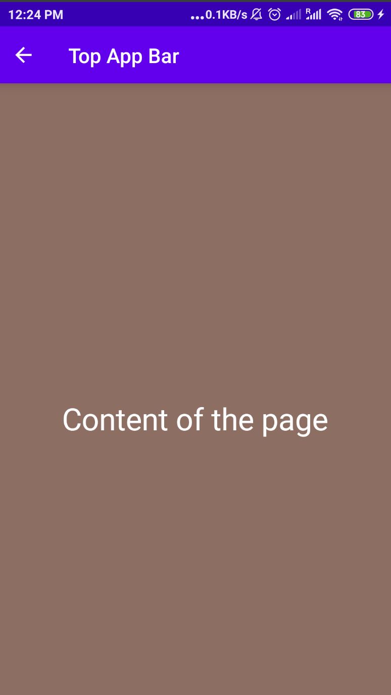
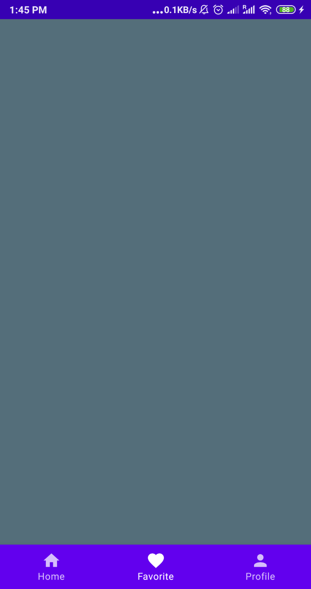

# TopAppBar y Bottom Navigation con Scaffold

> Aprende a implementar la estructura de layout de Material Design con Scaffold, incluyendo TopAppBar, Bottom Navigation, FAB y menú lateral (Drawer).

*Avanzado · 10 de febrero de 2024 · 8 min de lectura*  
*Fuente (en inglés): <https://www.jetpackcompose.net/topappbar-and-bottom-navigation-with-scaffold>*

## ¿Qué es Scaffold?

Permite implementar una interfaz con la estructura de layout básica de Material Design. Con ayuda de `Scaffold` puedes añadir los siguientes widgets:

- TopAppBar (Toolbar, barra superior)
- Floating Action Button (FAB, botón de acción flotante)
- Drawer Menu (menú lateral)
- Bottom Navigation (navegación inferior)

**Estructura de Scaffold:**

```kotlin
Scaffold(
    topBar = { //your top bar  },
    floatingActionButton = {//your floating action button},
    drawerContent = { //drawer content },
    content = { //your page content},
    bottomBar = { //your bottom bar composable }
)
```

**Ejemplo sencillo:**

```kotlin
@Composable
fun ScaffoldSample() {
    val scaffoldState = rememberScaffoldState(rememberDrawerState(DrawerValue.Closed))
    Scaffold(
        scaffoldState = scaffoldState,
        topBar = { TopAppBar(title = {Text("Top App Bar")},backgroundColor = MaterialTheme.colors.primary)  },
        floatingActionButtonPosition = FabPosition.End,
        floatingActionButton = { FloatingActionButton(onClick = {}){
            Icon(imageVector = Icons.Default.Add, contentDescription = "fab icon")
        } },
        drawerContent = { Text(text = "Drawer Menu 1") },
        content = { Text("Content") },
        bottomBar = { BottomAppBar(backgroundColor = MaterialTheme.colors.primary) { Text("Bottom App Bar") } }
    )
}
```

Añadimos `topBar`, `floatingActionButton`, `drawerContent` y `bottomBar`.

**Resultado:**



## TopAppBar

**Atributos de TopAppBar**

- **title**: se usa para representar el título de nuestra barra de acción.
- **navigationIcon**: icono que se muestra al comienzo de la barra de la aplicación.
- **backgroundColor**: se usa para indicar el color de fondo de la barra superior.
- **contentColor**: color que se aplica al contenido de nuestra barra de acción.
- **elevation**: se usa para dar elevación a la barra superior.

> *Si eres desarrollador de Android:* es el **Toolbar**.

**Estructura de TopAppBar**

```kotlin
TopAppBar(
    title = {
        //composable function for title
    },
    navigationIcon = {
        //composable function for leading icon
    },
    backgroundColor = //color code,
    contentColor = //color code,
    elevation = //your elevation value in Dp
)
```

**Código de ejemplo:**

```kotlin
@Composable
fun ScaffoldWithTopBar() {
    Scaffold(
        topBar = {
            TopAppBar(
                title = {
                    Text(text = "Top App Bar")
                },
                navigationIcon = {
                    IconButton(onClick = {}) {
                        Icon(Icons.Filled.ArrowBack, "backIcon")
                    }
                },
                backgroundColor = MaterialTheme.colors.primary,
                contentColor = Color.White,
                elevation = 10.dp
            )
        }, content = {
            Column(
                modifier = Modifier
                    .fillMaxSize()
                    .background(Color(0xff8d6e63)),
                verticalArrangement = Arrangement.Center,
                horizontalAlignment = Alignment.CenterHorizontally
            ) {
                Text(
                    text = "Content of the page",
                    fontSize = 30.sp,
                    color = Color.White
                )
            }
        })
}
```

**Resultado:**



## BottomNavigation

Con `BottomNavigation` podemos mostrar elementos de menú en la parte inferior de la pantalla. Facilita que los usuarios exploren y cambien entre las vistas de nivel superior con un solo toque.

> *Si eres desarrollador de Android:* es el **BottomNavigationView**.

**Estructura de BottomNavigation:**

```kotlin
BottomNavigation(
    modifier = //your modifier ,
    backgroundColor = //color code,
    contentColor = //color code,
    elevation = //your elevation value in Dp
) {
    BottomNavigationItem1()
    BottomNavigationItem2()
    BottomNavigationItem3()
}
```

## Código de ejemplo de BottomNavigation

**Paso 1: crear una función composable para BottomNavigation**

```kotlin
@Composable
fun BottomBar() {
    val selectedIndex = remember { mutableStateOf(0) }
    BottomNavigation(elevation = 10.dp) {

        BottomNavigationItem(icon = {
            Icon(imageVector = Icons.Default.Home,"")
        },
            label = { Text(text = "Home") },
            selected = (selectedIndex.value == 0),
            onClick = {
                selectedIndex.value = 0
            })

        BottomNavigationItem(icon = {
            Icon(imageVector = Icons.Default.Favorite,"")
        },
            label = { Text(text = "Favorite") },
            selected = (selectedIndex.value == 1),
            onClick = {
                selectedIndex.value = 1
            })

        BottomNavigationItem(icon = {
            Icon(imageVector = Icons.Default.Person,"")
        },
            label = { Text(text = "Profile") },
            selected = (selectedIndex.value == 2),
            onClick = {
                selectedIndex.value = 2
            })
    }
}
```

**Paso 2: añadirla al Scaffold**

```kotlin
@Composable
fun ScaffoldWithBottomMenu() {
    Scaffold(bottomBar = {BottomBar()}) {
      //content area
      Box(modifier = Modifier
          .background(Color(0xff546e7a))
          .fillMaxSize())
    }
}
```

**Resultado:**



**Código fuente:** [GitHub](https://github.com/JetpackCompose/Jetpack-Compose-Samples/blob/master/JetPackComposeSamples/app/src/main/java/net/jetpackcompose/composetext/activities/ActivityScaffold.kt)
