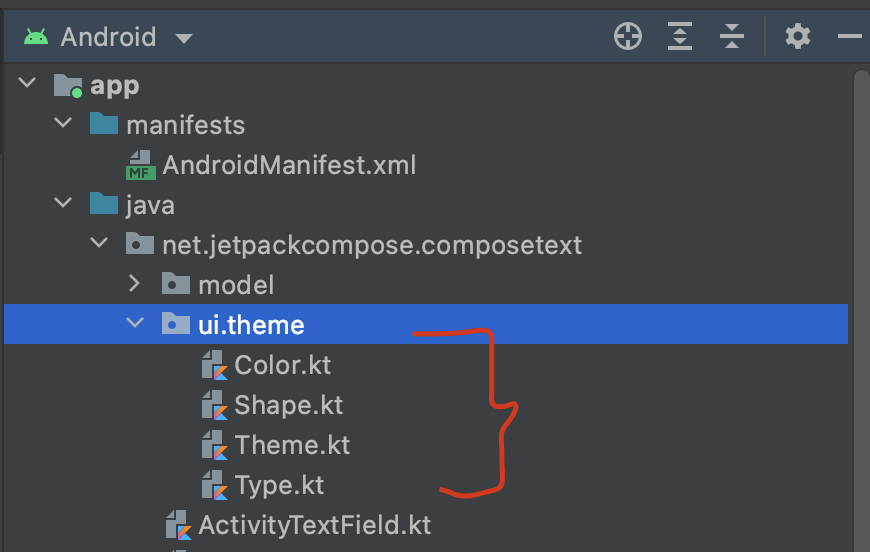
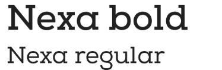

# Temas y tipografía en Jetpack Compose

> Aprende a personalizar Material Theme en Jetpack Compose: colores, tipografía, fuentes personalizadas y temas oscuro y claro.

*Avanzado · 20 de febrero de 2024 · 10 min de lectura*  
*Fuente (en inglés): <https://www.jetpackcompose.net/jetpack-compose-themes-and-typography>*

## Paquete del tema (Theme Package)

Si creas un proyecto nuevo de Jetpack Compose, verás el paquete **ui.theme**. Contiene las siguientes clases:

- **Color.kt**: para colores personalizados.
- **Shape.kt**: para formas personalizadas.
- **Type.kt**: para tipografía personalizada.
- **Theme.kt**: para temas personalizados.

## Material Theme

Un Material Theme define los principios de estilo de la especificación de Material Design. En Jetpack Compose, `MaterialTheme` está disponible como función composable con la que podemos personalizar los atributos por defecto.

```kotlin
MaterialTheme(
    colors = colors,
    typography = Typography,
    shapes = Shapes,
    content = content
)
```

Los componentes de Material Design (botones, cards, switches, etc.) están construidos sobre Material Theming, que es una forma sistemática de personalizar Material Design para que refleje mejor la marca de tu producto.

## Personalización de MaterialTheme

Podemos personalizar los colores, la tipografía, las formas y los temas con estos archivos:



## 1. Colores

**En Color.kt**

```kotlin
val Purple200 = Color(0xFFBB86FC)
val Teal200 = Color(0xFF03DAC5)
//you can add your own color here
```

- Los dos primeros caracteres, `0x`, indican al compilador que es un número hexadecimal.
- Los dos siguientes, "FF", representan la transparencia (alfa) en hexadecimal.
- Los seis caracteres restantes (tres pares) representan el rojo, el verde y el azul.

## 2. Tipografía (estilo de fuente)

La clase `Typography` de Material Theme incluye algunos estilos de texto predeterminados.

```kotlin
class Typography(
    defaultFontFamily: FontFamily = FontFamily.Default,
    h1: TextStyle,
    h2: TextStyle,
    h3: TextStyle,
    h4: TextStyle,
    h5: TextStyle,
    h6: TextStyle,
    subtitle1: TextStyle,
    subtitle2: TextStyle,
    body1: TextStyle,
    body2: TextStyle,
    button: TextStyle,
    caption: TextStyle,
    overline: TextStyle
)
```

### 2a. ¿Cómo sobrescribir o personalizar los TextStyle predeterminados?

**Paso 1: crear una tipografía personalizada**

```kotlin
val MyCustomTypography = Typography(
    body1 = TextStyle(
        fontFamily = FontFamily.SansSerif,
        fontWeight = FontWeight.Normal,
        fontSize = 18.sp
    )
)
```

**Paso 2: aplicar esta tipografía en MaterialTheme**

```kotlin
MaterialTheme(
    typography = MyCustomTypography,
    // ...
)
```

**Paso 3: usarla en tus widgets**

```kotlin
Text(
    text = "Customized TextStyle (Body1) ",
    style = MaterialTheme.typography.body1
)
```

### 2b. ¿Cómo añadir nuevos estilos de texto en el tema de Material?

**Paso 1: añadir un nuevo estilo de texto mediante una propiedad de extensión**

```kotlin
val Typography.customTitle: TextStyle
    @Composable
    get() {
        return TextStyle(
            fontFamily = FontFamily.Monospace,
            fontWeight = FontWeight.Bold,
            fontSize = 30.sp
        )
    }
```

**Paso 2: usarlo en tus widgets**

```kotlin
Text(text = "Custom", style = MaterialTheme.typography.customTitle)
```

### 2c. ¿Cómo usar una fuente personalizada?

**Paso 1: crear la carpeta `font`** dentro de tu carpeta `res`.

**Paso 2: pegar tus archivos de fuente** en la carpeta `font`.

**Paso 3: crear la variable `fontFamily`**

```kotlin
val NexaFont = FontFamily(
    Font(R.font.nexa_regular, FontWeight.Normal),
    Font(R.font.nexa_bold, FontWeight.Bold)
)
```

**Paso 4: indicar la `fontFamily` en tu TextStyle**

```kotlin
val Typography = Typography(
    subtitle1 = TextStyle(
        fontFamily = NexaFont,
        fontWeight = FontWeight.Bold,
        fontSize = 30.sp,
    ),
    subtitle2 = TextStyle(
        fontFamily = NexaFont,
        fontSize = 20.sp,
    )
)
```

**Paso 5: usarla en tus widgets**

```kotlin
Text(text = "Nexa bold", style = MaterialTheme.typography.subtitle1)
Text(text = "Nexa regular", style = MaterialTheme.typography.subtitle2)
```

**Resultado:**



## 3. Tema oscuro y claro

**Paso 1: crear conjuntos de colores para los temas oscuro y claro**

```kotlin
private val DarkColorPalette = darkColors(
    primary = Color.Black,
    primaryVariant = Color.Black,
    secondary = Color.LightGray,
)

private val LightColorPalette = lightColors(
    primary = Purple500,
    primaryVariant = Purple700,
    secondary = Teal200
)
```

**Paso 2: crear un tema personalizado**

```kotlin
@Composable
fun MyAppTheme(
    darkTheme: Boolean = isSystemInDarkTheme(),
    content: @Composable() () -> Unit
) {
    val colors = if (darkTheme) {
        DarkColorPalette
    } else {
        LightColorPalette
    }

    MaterialTheme(
        colors = colors,
        typography = Typography,
        shapes = Shapes,
        content = content
    )
}
```

**Paso 3: envolver tu función composable dentro de este tema**

```kotlin
val isDarkTheme = remember { mutableStateOf(false) }

MyAppTheme(darkTheme = isDarkTheme.value) {
   //your composable function
}
```

**Código fuente:** [GitHub](https://github.com/JetpackCompose/Jetpack-Compose-Text/blob/master/Compose%20Text/app/src/main/java/net/jetpackcompose/composetext/ThemesSamplesActivity.kt)

**Para más detalles, consulta la documentación oficial:** <https://developer.android.com/jetpack/compose/themes>
