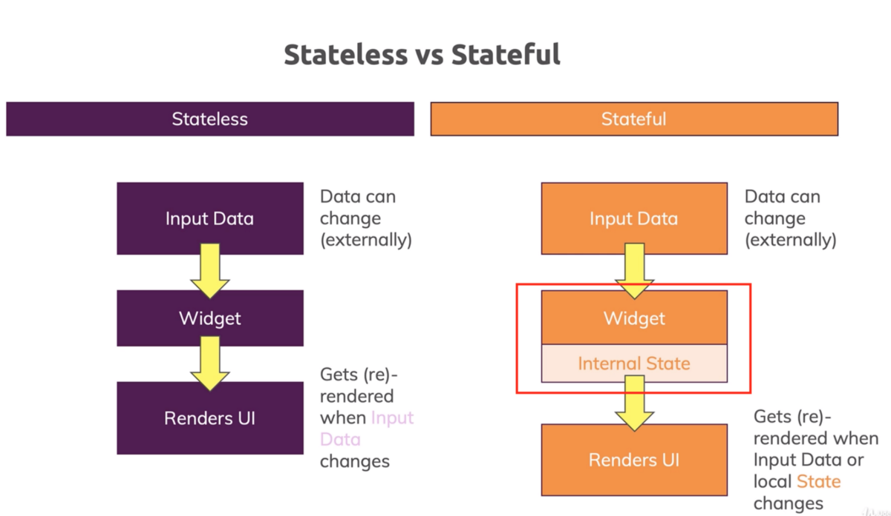
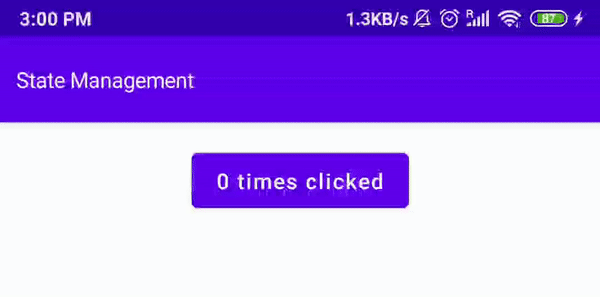
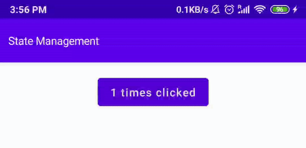
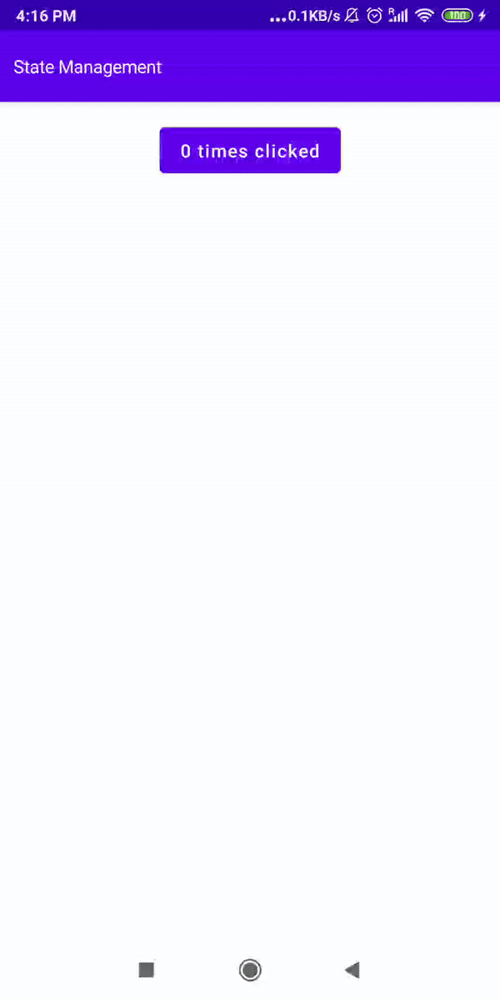

# Gestión del estado (State Management) en Jetpack Compose

> Comprende la gestión del estado en Jetpack Compose: aprende qué son State, MutableState, remember y rememberSaveable.

*Avanzado · 15 de febrero de 2024 · 7 min de lectura*  
*Fuente (en inglés): <https://www.jetpackcompose.net/state-management-in-jetpack-compose>*

## ¿Qué es el estado (state) en Jetpack Compose?

Un estado (*state*) es un objeto que puede almacenar nuestros datos. Si los datos cambian, actualiza todos los widgets de la interfaz que están suscritos a él. Si quieres actualizar los datos de tus widgets en tiempo de ejecución, puedes usar un objeto de estado.

## Stateful vs. Stateless (con estado y sin estado)



## `State<T>`

Un tipo que contiene un valor de solo lectura: notifica a la composición cuando el valor cambia.

## `MutableState<T>`

Es una subinterfaz de `State` que nos permite actualizar el valor. Cuando se escribe en la propiedad `value` y el valor **cambia**, se programa la recomposición de todos los `RecomposeScope` suscritos. Si se escribe el **mismo valor**, no se programa ninguna recomposición.

**Ejemplo:**

```kotlin
var selectedIndex by mutableStateOf(0)
//selectedIndex = 5
```

## Sin estado (No State)

Si creamos el objeto sin estado, la interfaz no se actualiza cuando cambian los datos.

```kotlin
@Composable
fun NoState() {
    var clickCount = 0
    Column {
        Button(onClick = {
            clickCount++
            Log.d("TAG", "NoState: "+clickCount)
        }) {
            Text(text = ""+clickCount+" times clicked")
        }
    }
}
```

**Resultado:**



Al pulsar el botón se dispara el evento `onClick`, pero el contador no se actualiza. Sin embargo, si miras el logcat, verás que el valor de la variable aumenta con cada clic.

**¿Por qué no se actualiza la interfaz?**

Solo cambia el valor de la variable, pero nuestra interfaz necesita refrescarse. Para que la interfaz se refresque automáticamente necesitamos objetos de estado. Si usamos un objeto de estado, la interfaz se actualizará automáticamente cuando cambien los datos.

## Con un objeto de estado (With State Object)

```kotlin
@Composable
fun MutableStateClick() {
    var clickCount by mutableStateOf(0)//Not recommended
    Column {
        Button(onClick = { clickCount++ }) {
            Text(text = "" + clickCount + " times clicked")
        }
    }
}
```

**Resultado:**



Funciona como se espera, pero tiene algunos problemas: si usas este objeto de estado con un composable hijo, no funcionará. Cuando usas este código, Android Studio muestra un aviso y recomienda usarlo junto con **remember**.

## Remember

La función `remember` permite guardar un objeto en memoria entre recomposiciones, sea mutable o inmutable. Si ese objeto es un estado (por ejemplo, `mutableStateOf`) y su valor cambia, se dispara la recomposición (se refresca la interfaz) para actualizar los widgets.

**Sintaxis:**

```kotlin
val currentValue = remember { mutableStateOf(0) } //Int
val userName = remember { mutableStateOf("") } //String
```

**Ejemplo:**

```kotlin
@Composable
fun RememberSample() {
    var clickCount by remember { mutableStateOf(0) }
    Column {
        Button(onClick = { clickCount++ }) {
            Text(text = "" + clickCount + " times clicked")
        }
    }
}
```

`remember` también funciona con composables hijos. Puedes pasarlo como argumento a la función de tu composable hijo.

**Inconveniente (Drawback):**

Si cambia la orientación del dispositivo, el valor se reinicia.

Si quieres conservar los datos aunque la activity se recree o cambie la orientación, usa `rememberSaveable`.

## Remember Saveable

Usa `rememberSaveable` para restaurar el estado de tu interfaz después de que se recree una activity o un proceso. `rememberSaveable` conserva el estado entre recomposiciones y, además, también lo conserva cuando se recrean la activity y el proceso.

```kotlin
@Composable
fun RememberSaveableSample() {
    var clickCount = rememberSaveable { mutableStateOf(0) }
    Column {
        Button(onClick = { clickCount.value++ }) {
            Text(text = "" + clickCount.value + " times clicked")
        }
    }
}
```

**Resultado:**



**Para más información sobre State Hoisting (elevación del estado), consulta la documentación oficial:** <https://developer.android.com/jetpack/compose/state>

**Código fuente:** [GitHub](https://github.com/JetpackCompose/Jetpack-Compose-Samples/blob/master/JetPackComposeSamples/app/src/main/java/net/jetpackcompose/composetext/activities/ActivityStateManagement.kt)
