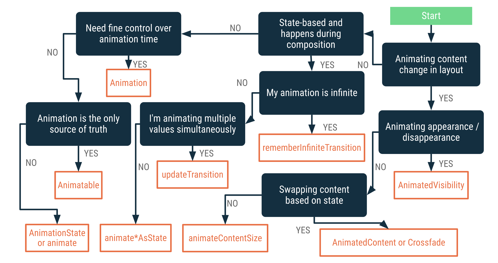
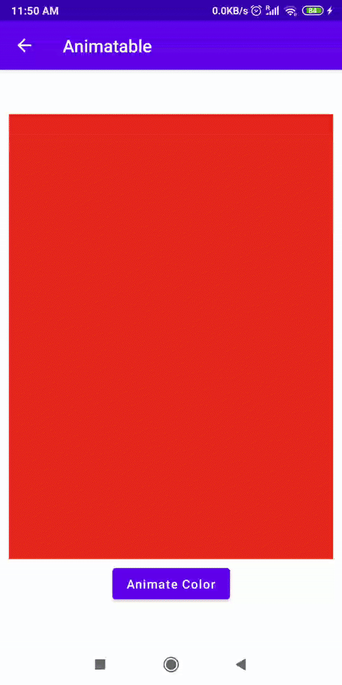
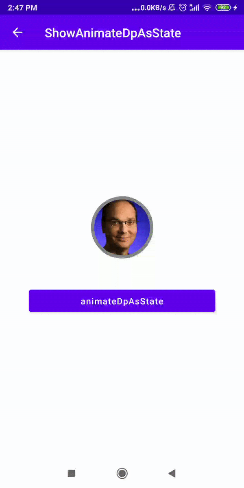
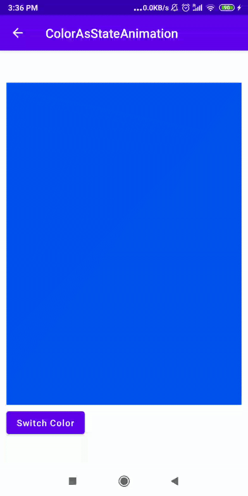
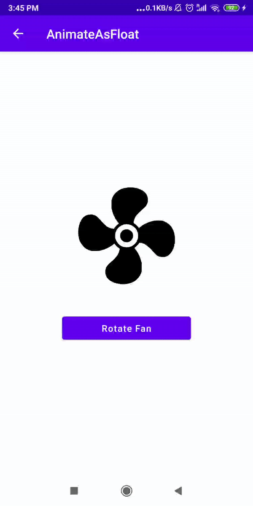
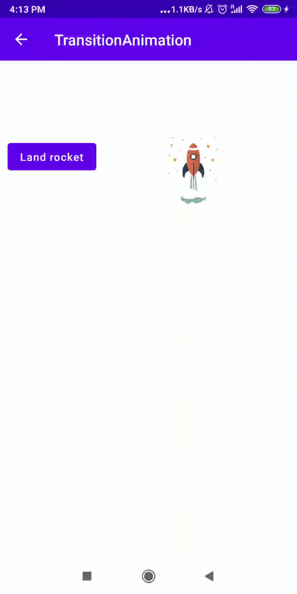
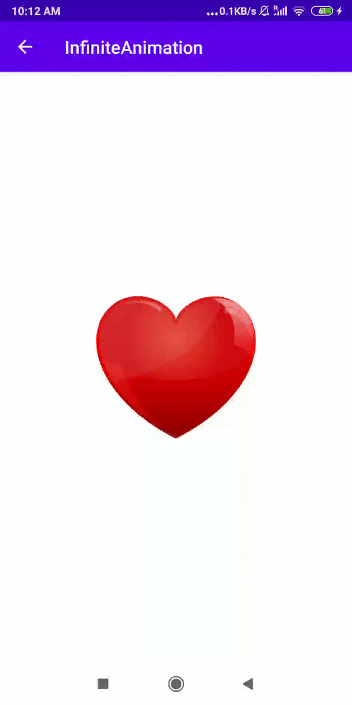

# Animaciones en Jetpack Compose

> Domina las animaciones en Jetpack Compose: aprende las APIs Animatable, animate*AsState, updateTransition e InfiniteTransition.

*Avanzado · 25 de febrero de 2024 · 12 min de lectura*  
*Fuente (en inglés): <https://www.jetpackcompose.net/jetpack-compose-animations>*

## Animaciones en Jetpack Compose

Las animaciones son fundamentales en las aplicaciones móviles: ofrecen una experiencia de usuario fluida. Jetpack Compose dispone de varias APIs de animación.



En este tutorial aprenderemos las siguientes APIs de animación:

1. `Animatable`
2. `animate*AsState` (`animateDpAsState`, `animateColorAsState`, `animateFloatAsState`)
3. `updateTransition`
4. `InfiniteTransition`

## 1. Animatable

`Animatable` es una API basada en corrutinas para animar un único valor. Con ella podemos animar valores de color o de tipo float. Se diferencia de todas las demás APIs de animación **porque puedes usarla fuera de tu función composable.**

**Ejemplo:**

```kotlin
@Composable
private fun AnimatableSample() {
    var isAnimated by remember { mutableStateOf(false) }

    val color = remember { Animatable(Color.DarkGray) }

    LaunchedEffect(isAnimated) {
        color.animateTo(if (isAnimated) Color.Green else Color.Red, animationSpec = tween(2000))
    }

    Box(
        Modifier
            .fillMaxWidth()
            .fillMaxHeight(0.8f)
            .background(color.value)
    )
    Button(
        onClick = { isAnimated = !isAnimated },
        modifier = Modifier.padding(top = 10.dp)
    ) {
        Text(text = "Animate Color")
    }
}
```

**Resultado:**



### Personalización del AnimationSpec

Dispones de las siguientes funciones para personalizar tus animaciones:

1. `tween`
2. `keyframes`
3. `spring`
4. `repeatable`
5. `infiniteRepeatable`
6. `snap`

## 2. animate*AsState

Se usa para animar un único valor, que puede ser de tipo Dp, Color, Float, Integer, Offset, Rect o Size.

### 2a. animateDpAsState

```kotlin
@Composable
private fun AnimateDpAsState() {
    val isNeedExpansion = rememberSaveable{ mutableStateOf(false) }

    val animatedSizeDp: Dp by animateDpAsState(
        targetValue = if (isNeedExpansion.value) 350.dp else 100.dp
    )

    Column(horizontalAlignment = Alignment.CenterHorizontally) {
        CircleImage(animatedSizeDp)
        Button(
            onClick = { isNeedExpansion.value = !isNeedExpansion.value },
            modifier = Modifier.padding(top = 50.dp).width(300.dp)
        ) {
            Text(text = "animateDpAsState")
        }
    }
}
```

**Resultado:**



### 2b. animateColorAsState

```kotlin
@Composable
private fun AnimateColorAsState() {
    var isNeedColorChange by remember { mutableStateOf(false) }
    val backgroundColor by animateColorAsState(
        if (isNeedColorChange) Color.Green else Color.Blue,
        animationSpec = tween(durationMillis = 2000, easing = LinearEasing)
    )
    Column {
        Box(
            modifier = Modifier
                .fillMaxWidth()
                .fillMaxHeight(0.8f)
                .background(backgroundColor)
        )
        Button(onClick = { isNeedColorChange = !isNeedColorChange }) {
            Text(text = "Switch Color")
        }
    }
}
```

**Resultado:**



### 2c. animateFloatAsState

```kotlin
@Composable
private fun AnimateAsFloatContent() {
    var isRotated by rememberSaveable { mutableStateOf(false) }
    val rotationAngle by animateFloatAsState(
        targetValue = if (isRotated) 360F else 0f,
        animationSpec = tween(durationMillis = 2500)
    )
    Column(horizontalAlignment = Alignment.CenterHorizontally) {
        Image(
            painter = painterResource(R.drawable.fan),
            contentDescription = "fan",
            modifier = Modifier.rotate(rotationAngle).size(150.dp)
        )
        Button(onClick = { isRotated = !isRotated }) {
            Text(text = "Rotate Fan")
        }
    }
}
```

**Resultado:**



## 3. updateTransition

`updateTransition()` puede animar una o varias animaciones simultáneamente.

```kotlin
@Composable
private fun TransitionAnimation() {
    var isAnimated by remember { mutableStateOf(false) }
    val transition = updateTransition(targetState = isAnimated, label = "transition")

    val rocketOffset by transition.animateOffset(transitionSpec = {
        if (this.targetState) tween(1000) else tween(1500)
    }, label = "offset") { animated ->
        if (animated) Offset(200f, 0f) else Offset(200f, 500f)
    }

    val rocketSize by transition.animateDp(transitionSpec = {
        tween(1000)
    }, "") { animated ->
        if (animated) 75.dp else 150.dp
    }

    Column(modifier = Modifier.fillMaxSize()) {
        Image(
            painter = painterResource(id = R.drawable.rocket),
            contentDescription = "Rocket",
            modifier = Modifier
                .size(rocketSize)
                .offset(rocketOffset.x.dp, rocketOffset.y.dp)
        )
        Button(onClick = { isAnimated = !isAnimated }) {
            Text(text = if (isAnimated) "Land rocket" else "Launch rocket")
        }
    }
}
```

**Resultado:**



## 4. InfiniteTransition

Crea un `InfiniteTransition` que ejecuta animaciones hijas de forma infinita.

```kotlin
@Composable
fun InfiniteAnimation() {
    val infiniteTransition = rememberInfiniteTransition()

    val heartSize by infiniteTransition.animateFloat(
        initialValue = 100.0f,
        targetValue = 250.0f,
        animationSpec = infiniteRepeatable(
            animation = tween(800, delayMillis = 100, easing = FastOutLinearInEasing),
            repeatMode = RepeatMode.Reverse
        )
    )
    Image(
        painter = painterResource(R.drawable.heart),
        contentDescription = "heart",
        modifier = Modifier.size(heartSize.dp)
    )
}
```

**RepeatMode:**

- `RepeatMode.Restart`: se reinicia después de cada iteración.
- `RepeatMode.Reverse`: se invierte después de cada iteración.

**Resultado:**



**Para más información, consulta la documentación oficial:** <https://developer.android.com/jetpack/compose/animation>

**Código fuente:** [GitHub](https://github.com/JetpackCompose/Jetpack-Compose-Samples/blob/master/JetPackComposeSamples/app/src/main/java/net/jetpackcompose/composetext/activities/ActivityAnimations.kt)
